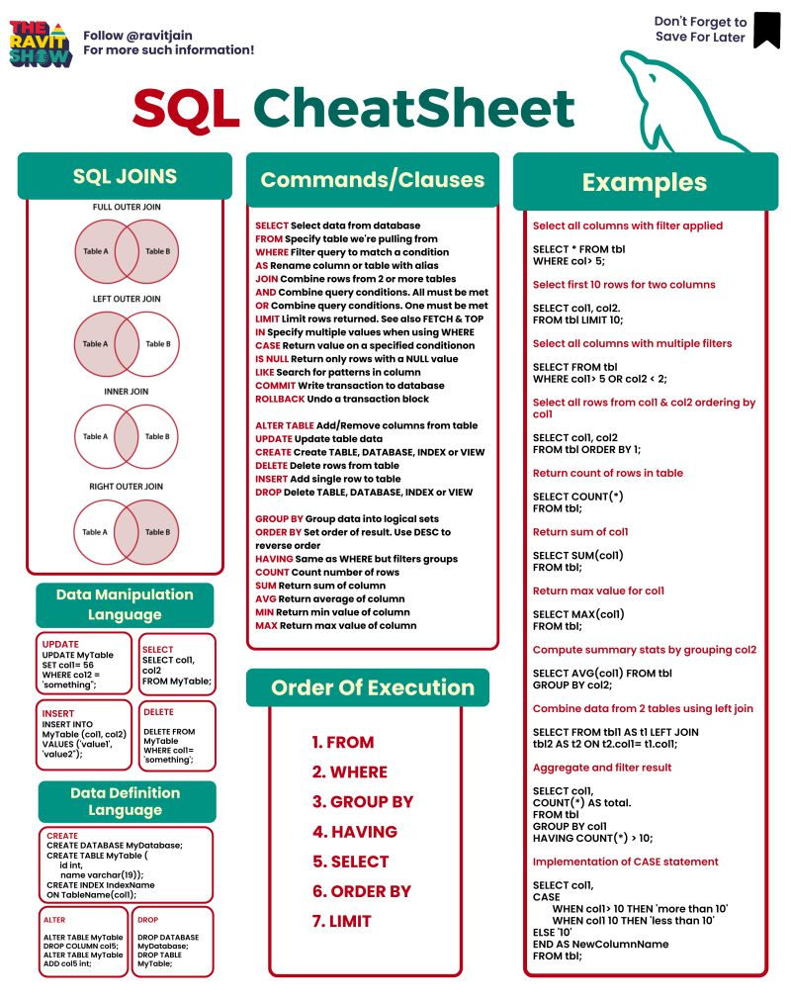

# 7 Essential SQL Joins Every Data Professional Must Know 🤝💡

## 1. Inner Join 🔄
   - Retrieves only the records with matching values in both tables.
   - Perfect for finding the common ground between two datasets.

## 2. Left Join ⬅️
   - Retrieves all records from the left table and matching records from the right table.
   - Ideal when you need all data from the left table, regardless of matches in the right table.

## 3. Left Join with Null Check ⬅️❓
   - Filters only the records where there is no match in the right table (NULL values).
   - Great for identifying orphaned or unmatched records in the left table.

## 4. Right Join ➡️
   - Retrieves all records from the right table and matching records from the left table.
   - Useful when you need all data from the right table, regardless of matches in the left table.

## 5. Right Join with Null Check ➡️❓
   - Filters only the records where there is no match in the left table (NULL values).
   - Perfect for finding orphaned or unmatched records in the right table.

## 6. Full Join 🔄🔄
   - Retrieves all records when there is a match in either the left or right table.
   - Ideal for combining complete datasets from both tables.

## 7. Full Join with Null Check 🔄❓
   - Filters only the records where there is no match in either the left or right table (NULL values).
   - Excellent for identifying records that exist exclusively in one table but not the other.