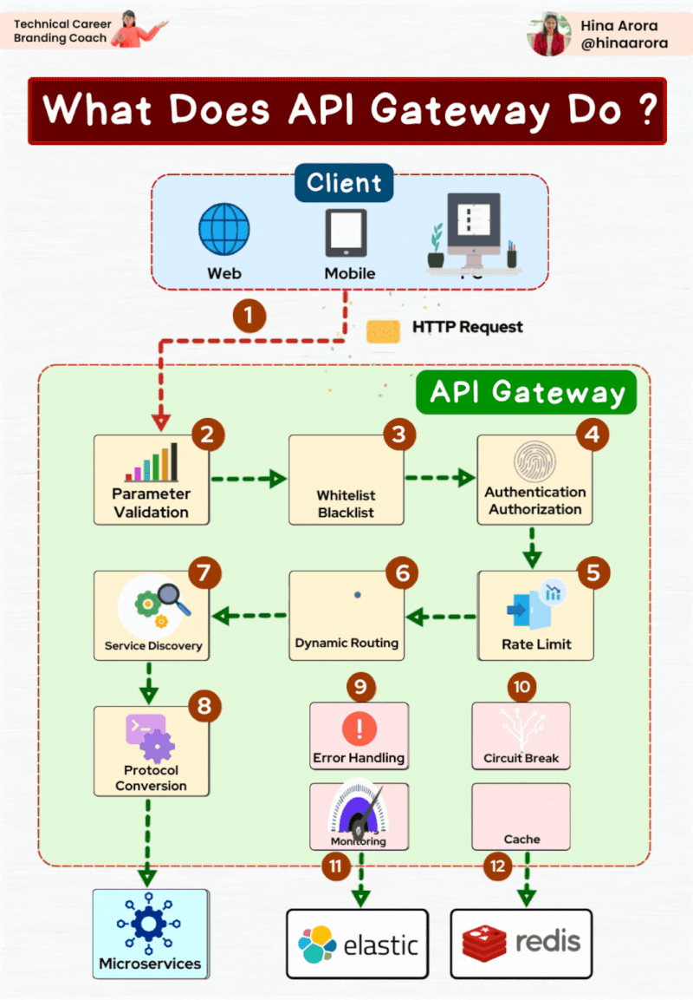

# API GateWay

❓𝐏𝐫𝐨𝐛𝐥𝐞𝐦:
Many developers have a backend API that they want to expose for other organizations or other developers to use, but they don’t know how to do so securely.

✅ 𝐄𝐱𝐢𝐬𝐭𝐢𝐧𝐠 𝐒𝐨𝐥𝐮𝐭𝐢𝐨𝐧𝐬:
API Gateways offer a way to easily create a proxy of your backend API, and often include API key authentication, rate limiting, analytics/monitoring, monetization, and other functionality useful for scaling an API.

✅ 𝐀𝐏𝐈 𝐠𝐚𝐭𝐞𝐰𝐚𝐲:
An API gateway is a software layer that sits between a client and a collection of backend services.
It acts as a reverse proxy to accept all application programming interface (API) calls, process them, direct them to the appropriate services, and return the appropriate result.

✅ 𝐀𝐏𝐈 𝐆𝐚𝐭𝐞𝐰𝐚𝐲 𝐂𝐚𝐩𝐚𝐛𝐢𝐥𝐢𝐭𝐢𝐞𝐬:

Security – Covering aspects such as authentication, authorization, access control, and encryption.

Routing – Involving routing, rate limiting, request/response manipulation, circuit breakers, blue-green and canary deployments, A/B testing, load balancing, health checks, and customized error handling.

Observability – Providing real-time and historical metrics, logging, and tracing capabilities.

✅𝐇𝐨𝐰 𝐚𝐧 𝐀𝐏𝐈 𝐆𝐚𝐭𝐞𝐰𝐚𝐲 𝐭𝐲𝐩𝐢𝐜𝐚𝐥𝐥𝐲 𝐰𝐨𝐫𝐤𝐬:

- Parameter Validation:
Validates parameters, ensuring they meet the expected format and constraints.

- Whitelist/Blacklist:
Whitelists or blacklists certain clients or IP addresses to control access.

- Auth & Authorization:
Ensures that the authenticated user has the necessary permissions to access the requested resource.

- Rate Limiting:
Enforces limits on the number of requests a client can make within a specified time period.

- Dynamic Routing:
Directs incoming requests to the appropriate microservice or backend service.
Uses routing rules to determine the destination based on the request path or parameters.

- Protocol Conversion:
Ensures that different services can communicate seamlessly, even if they use different languages or formats.

- Error Handling:
Customizes error responses and handles exceptions to prevent disruptions.

- Monitoring:
Tracks API health, performance metrics, and usage patterns.

- Caching:
Stores frequently used data to reduce latency and improve response times

✅ 𝐙𝐮𝐩𝐥𝐨’𝐬 𝐀𝐝𝐯𝐚𝐧𝐭𝐚𝐠𝐞:

Zuplo is fast and easy to get started with compared to other API gateways and is free to get started.

✅ 𝐖𝐡𝐚𝐭 𝐙𝐮𝐩𝐥𝐨 𝐎𝐟𝐟𝐞𝐫𝐬:

Zuplo is the fastest way to build and scale your API. It includes the following features:

- Blazing fast deployment times with unlimited environments, making iteration a breeze.

- GitOps workflow, so you always control your code - deploy to 300+ data centers globally on every git push.

- Expansive policy catalog, including API Key Authentication, Rate Limiting, and Request Validation.

- Ability to write custom endpoints and policies in Typescript.

- Advanced analytics on your API usage.

✅ Link to try this tool Free:👉 https://lnkd.in/dMisaDh7