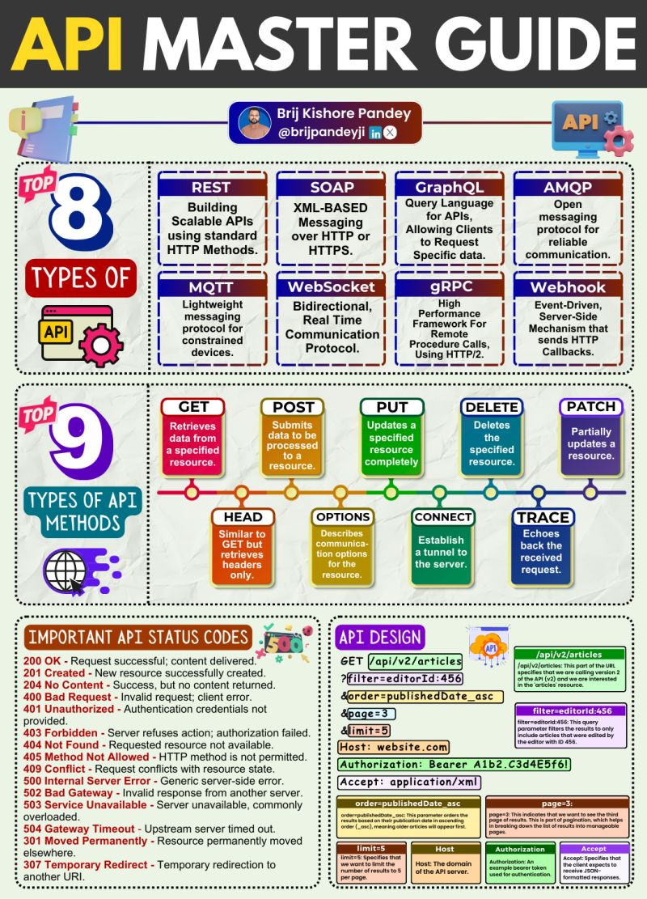

# API Master Guide

Introducing the API Master Guide infographic – your one-stop solution for 80% of your API work!

This carefully crafted infographic is designed to be your go-to resource for all things API.

Whether you're just starting your API journey or you're a seasoned developer, this guide will help you navigate the complex world of APIs with confidence.

🔍 What's Packed Inside:

✅ Top 8 Types of API: Uncover the most widely used API types, from REST to WebSocket, and understand their unique characteristics and use cases.

✅ 9 Essential API Methods: Master the fundamental HTTP methods like GET, POST, and DELETE, and learn how to leverage them effectively in your API interactions.

✅ Critical API Status Codes: Get acquainted with the key status codes you'll encounter and learn how to interpret them for seamless API communication.

✅ API Design Best Practices: Discover the industry-recommended practices for designing efficient, scalable, and developer-friendly APIs.

This infographic is the result of hours of research, design, and refinement, fueled by my deep passion for APIs and my desire to create a comprehensive resource for the community.
