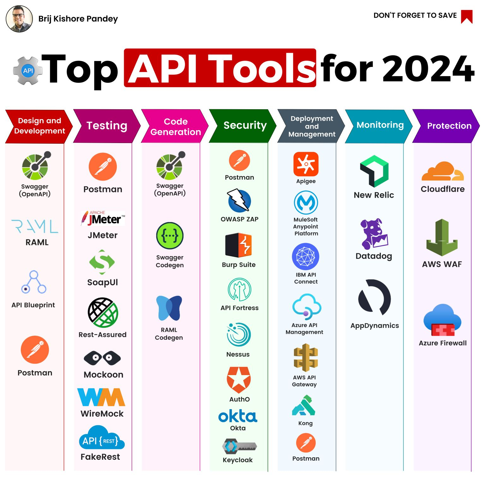

# 𝗔𝗣𝗜 𝗧𝗼𝗼𝗹𝘀 𝗬𝗼𝘂 𝗡𝗲𝗲𝗱 𝘁𝗼 𝗞𝗻𝗼𝘄 𝗶𝗻 𝟮𝟬𝟮𝟰

APIs are the building blocks of modern software development. But with so many API tools on the market, it can be tough to know where to start. I have created this infographic to provide a helpful overview of some of the most popular tools for design, testing, code generation, security, deployment, monitoring, and protection.

## 𝗗𝗲𝘀𝗶𝗴𝗻 𝗮𝗻𝗱 𝗗𝗲𝘃𝗲𝗹𝗼𝗽𝗺𝗲𝗻𝘁
- Swagger (OpenAPI): An open-source framework for creating and consuming RESTful APIs.
- RAML: Another open-source API description language.

## 𝗧𝗲𝘀𝘁𝗶𝗻𝗴
- Postman: A popular tool for sending API requests and inspecting responses.
- JMeter: An open-source load testing tool.

## 𝗖𝗼𝗱𝗲 𝗚𝗲𝗻𝗲𝗿𝗮𝘁𝗶𝗼𝗻
- Swagger Codegen: Generates client and server code from your API definition.
- RAML Codegen: Generates code from RAML API definitions.

## 𝗦𝗲𝗰𝘂𝗿𝗶𝘁𝘆
- OWASP ZAP: An open-source penetration testing tool for APIs.
- Burp Suite: A commercial suite of security testing tools.

## 𝗗𝗲𝗽𝗹𝗼𝘆𝗺𝗲𝗻𝘁
- Apigee: A platform for managing and deploying APIs.
- MuleSoft Anypoint Platform: A similar platform for managing APIs and integrations.

## 𝗠𝗼𝗻𝗶𝘁𝗼𝗿𝗶𝗻𝗴
- New Relic: A monitoring tool that can be used to monitor APIs.
- Datadog: Another monitoring tool that can be used to monitor APIs.

## 𝗣𝗿𝗼𝘁𝗲𝗰𝘁𝗶𝗼𝗻
- Cloudflare WAF: A web application firewall that can help protect APIs from attacks.
- AWS WAF: Another web application firewall that can help protect APIs.