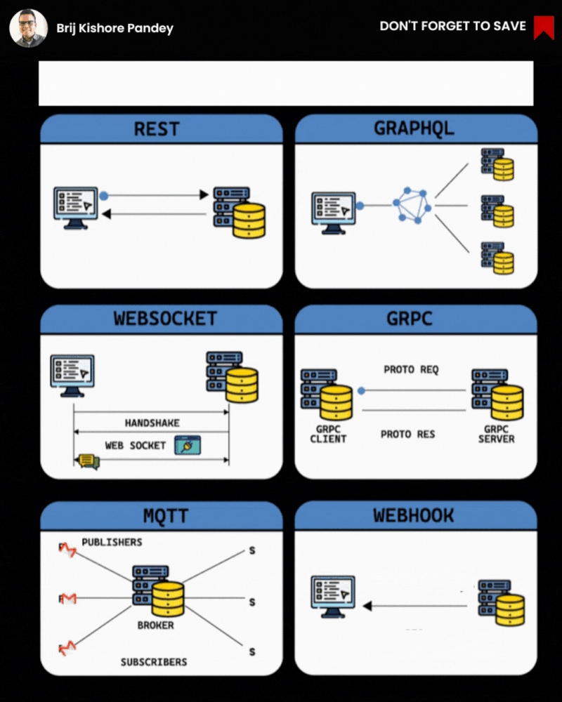

# APIs: Essential Building Blocks of Modern Software

APIs  are crucial components in modern software development, enabling different applications to communicate and exchange data efficiently. There are several popular API styles, each with its own advantages and disadvantages.

REST APIs : are the most widely used, employing simple HTTP requests and responses for data transfer. While straightforward to implement, REST may not be ideal for real-time applications.

GraphQL : offers a more efficient approach, allowing clients to request specific data using a powerful query language. However, it requires additional setup compared to REST.

WebSockets : provide real-time, bidirectional communication between client and server, making them perfect for interactive applications. But for simpler use cases, they may be excessive.

gRPC : using Google's Protocol Buffers over HTTP/2, delivers high performance but requires more configuration than REST.

MQTT : a lightweight publish-subscribe protocol, is well-suited for IoT device communication but may not be optimal for complex interactive applications.

Webhooks : enable servers to notify clients of events, but their reliability is not guaranteed.

When selecting an API style, consider your project's specific needs:

- For speed-critical applications, opt for WebSockets or gRPC.
- If simplicity is key, REST is a solid choice.
- For real-time functionality, WebSockets streamline development.

By aligning your API choice with your project's requirements, you can leverage the full potential of these essential building blocks in modern software development.

𝐒𝐎𝐀𝐏 (𝐒𝐢𝐦𝐩𝐥𝐞 𝐎𝐛𝐣𝐞𝐜𝐭 𝐀𝐜𝐜𝐞𝐬𝐬 𝐏𝐫𝐨𝐭𝐨𝐜𝐨𝐥): SOAP is a protocol-based standard for exchanging structured information. It's known for its strict standards, security features, and reliability. SOAP is a good choice for complex enterprise applications.

𝐑𝐄𝐒𝐓𝐟𝐮𝐥 (𝐑𝐞𝐩𝐫𝐞𝐬𝐞𝐧𝐭𝐚𝐭𝐢𝐨𝐧𝐚𝐥 𝐒𝐭𝐚𝐭𝐞 𝐓𝐫𝐚𝐧𝐬𝐟𝐞𝐫): RESTful APIs are based on the principles of simplicity, statelessness, and resource-based interactions. They're lightweight and suitable for web and mobile applications. RESTful APIs are the most popular API style today.

𝐆𝐫𝐚𝐩𝐡𝐐𝐋: GraphQL is a query language for APIs that provides a more flexible and efficient approach. It allows clients to request precisely the data they need, reducing over-fetching and under-fetching. GraphQL is excellent for building client-driven applications.

𝐠𝐑𝐏𝐂: gRPC is a high-performance framework for building efficient, real-time APIs. It uses Protocol Buffers for serialization and offers features like authentication, load balancing, and bidirectional streaming. gRPC is ideal for microservices and real-time applications.

𝐖𝐞𝐛𝐒𝐨𝐜𝐤𝐞𝐭: WebSocket is a protocol that enables full-duplex, bidirectional communication channels over a single TCP connection. It's perfect for real-time applications like chat, online gaming, and financial trading platforms. WebSocket APIs provide low latency and high interactivity.

𝐖𝐞𝐛hook: Webhooks are a way for apps to send real-time data to other applications when specific events occur. They work on a publish-subscribe model, notifying subscribers when relevant events happen. Webhooks are crucial for event-driven architectures and integrations.
