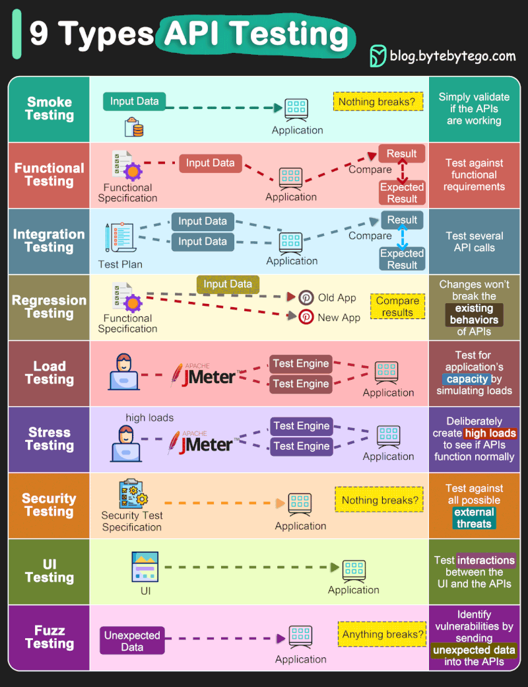
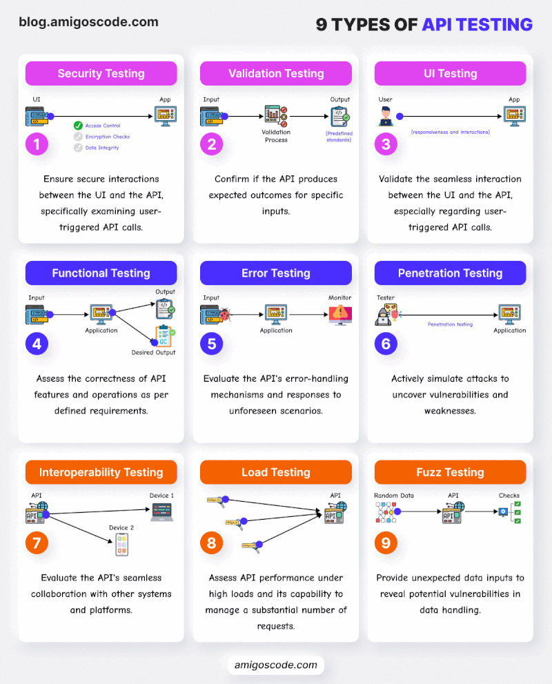

# API Testing

API testing is crucial for ensuring the reliability, security, and performance of applications. Here are 9 types of API testing you should know about:

1. Functional Testing: Verifying the functionality of individual API endpoints.
1. Load Testing: Assessing how well an API handles different levels of traffic.
1. Security Testing: Identifying vulnerabilities and ensuring data protection.
1. Interoperability Testing: Testing the compatibility of APIs with various systems and platforms.
1. Validation Testing: Validating responses against predefined expectations.
1. Negative Testing: Checking the API's behavior under unexpected or invalid inputs.
1. Stress Testing: Evaluating performance under extreme conditions to ensure stability.
1. Reliability Testing: Testing for consistency and reliability over time.
1. Automated Testing: Streamlining testing processes with automation tools and frameworks.

1. Security Testing
2. Validation Testing
3. UI Testing
4. Functional Testing
5. Error Testing
6. Penetration Testing
7. Interoperability Testing
8. Load Testing
9. Fuzz Testing