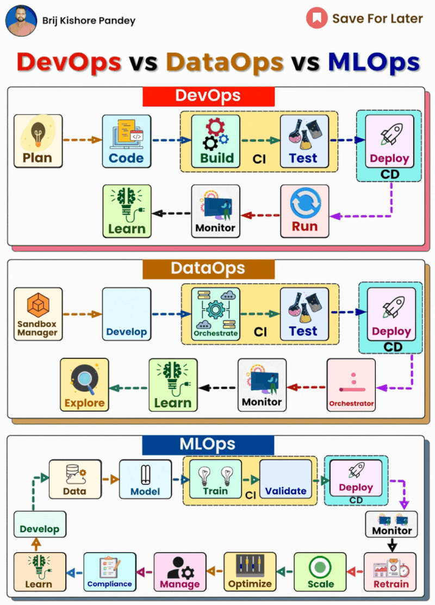

# DevOps VS DataOps Vs MLOps

In today's data-driven world, DevOps, DataOps, and MLOps have become critical for streamlining work processes.

While the concepts seem similar on the surface, understanding the nuances helps optimize different parts of the workflow.

👉 Here's a quick breakdown:

🔹𝗗𝗲𝘃𝗢𝗽𝘀 streamlines software delivery by integrating all stages of development and operations.

This includes planning, coding, continuous integration (CI) through building and testing, continuous deployment (CD), operation, and feedback.

It's about efficient, continuous delivery and improvement.

𝗙𝗼𝗿𝗺𝘂𝗹𝗮: Plan + Code + CI (Build + Test) + CD (Deploy) + Operate (Run + Monitor) + Feedback (Learn + Plan)

🔹𝗗𝗮𝘁𝗮𝗢𝗽𝘀 focuses on optimizing data analytics processes. It encompasses data exploration, development, CI (orchestration and testing), CD, operation (orchestration and monitoring), and feedback (analysis and exploration).

It ensures that data is accurate, readily available, and efficiently used.

𝗙𝗼𝗿𝗺𝘂𝗹𝗮: Explore (Sandbox Management) + Develop + CI (Orchestrate + Test) + CD (Deploy) + Operate (Orchestrate + Monitor) + Feedback (Analyze + Explore)

🔹𝗠𝗟𝗢𝗽𝘀 is the application of DevOps principles to machine learning.

It involves model development, CI (training and validation), CD, operation (monitoring and retraining), maintenance (scaling and optimization), governance (management and compliance), and feedback (learning and development).

MLOps ensures that ML models are effectively deployed and maintained in production environments.

𝗙𝗼𝗿𝗺𝘂𝗹𝗮: Develop (Data + Model) + CI (Train + Validate) + CD (Deploy) + Operate (Monitor + Retrain) + Maintain (Scale + Optimize) + Govern (Manage + Compliance) + Feedback (Learn + Develop)
