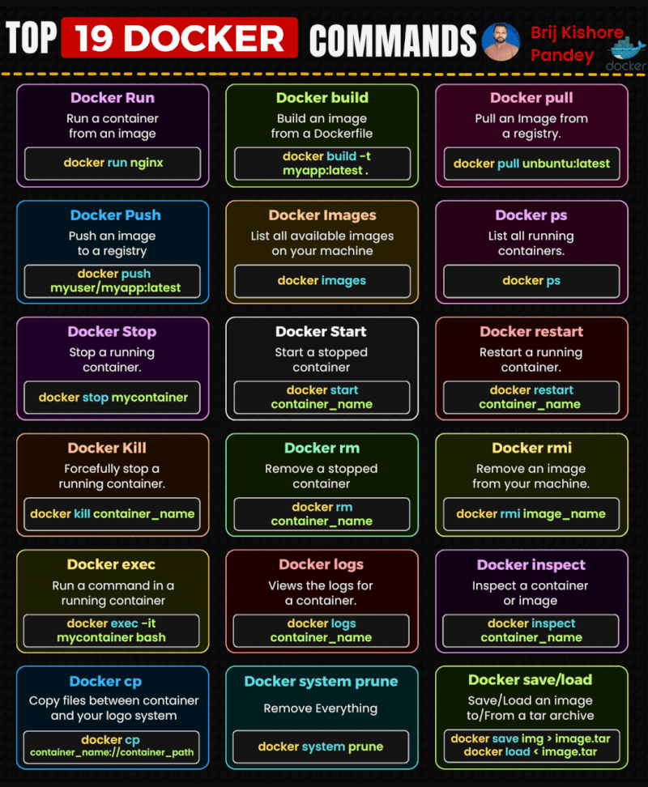

# Docker Commands

As Docker adoption accelerates, developing core Docker literacy is becoming essential for developers, data scientists, QA engineers, and other technical roles.

Regardless of your technical role, grasping these fundamental Docker concepts and commands is crucial:

𝗜𝗺𝗮𝗴𝗲 𝗠𝗮𝗻𝗮𝗴𝗲𝗺𝗲𝗻𝘁
- Use 𝚍𝚘𝚌𝚔𝚎𝚛 𝚋𝚞𝚒𝚕𝚍 to create images from Dockerfiles, the blueprint for containers.
- 𝚍𝚘𝚌𝚔𝚎𝚛 𝚙𝚞𝚕𝚕 to download pre-built images from registries like Docker Hub.
- 𝚍𝚘𝚌𝚔𝚎𝚛 𝚙𝚞𝚜𝚑 to upload your images to remote registries.
- 𝚍𝚘𝚌𝚔𝚎𝚛 𝚒𝚖𝚊𝚐𝚎𝚜 lists locally stored images.
- 𝚍𝚘𝚌𝚔𝚎𝚛 𝚛𝚖𝚒 removes unwanted images.
- 𝚍𝚘𝚌𝚔𝚎𝚛 𝚝𝚊𝚐 tags images for organizational purposes.

𝗖𝗼𝗻𝘁𝗮𝗶𝗻𝗲𝗿 𝗟𝗶𝗳𝗲𝗰𝘆𝗰𝗹𝗲
- 𝚍𝚘𝚌𝚔𝚎𝚛 𝚛𝚞𝚗 launches a container from an image.
- 𝚍𝚘𝚌𝚔𝚎𝚛 𝚜𝚝𝚘𝚙 and 𝚍𝚘𝚌𝚔𝚎𝚛 𝚔𝚒𝚕𝚕 halt running containers gracefully or forcibly.
- 𝚍𝚘𝚌𝚔𝚎𝚛 𝚛𝚎𝚜𝚝𝚊𝚛𝚝 restarts a stopped container.
- 𝚍𝚘𝚌𝚔𝚎𝚛 𝚛𝚎𝚗𝚊𝚖𝚎 to rename existing containers.
- 𝚍𝚘𝚌𝚔𝚎𝚛 𝚕𝚘𝚐𝚜 prints logs of a container.
- 𝚍𝚘𝚌𝚔𝚎𝚛 𝚎𝚡𝚎𝚌 runs commands interactively in a container.

𝗡𝗲𝘁𝘄𝗼𝗿𝗸𝗶𝗻𝗴 𝗮𝗻𝗱 𝗦𝘁𝗼𝗿𝗮𝗴𝗲
- 𝚍𝚘𝚌𝚔𝚎𝚛 𝚗𝚎𝚝𝚠𝚘𝚛𝚔 manages custom networks containers connect to.
- 𝚍𝚘𝚌𝚔𝚎𝚛 𝚟𝚘𝚕𝚞𝚖𝚎 creates sharable storage volumes containers can mount.

𝗠𝗮𝗶𝗻𝘁𝗲𝗻𝗮𝗻𝗰𝗲
- 𝚍𝚘𝚌𝚔𝚎𝚛 𝚜𝚢𝚜𝚝𝚎𝚖 𝚙𝚛𝚞𝚗𝚎 cleans up unused containers, images, volumes, etc.
- 𝚍𝚘𝚌𝚔𝚎𝚛 𝚛𝚖 deletes stopped containers.
- 𝚍𝚘𝚌𝚔𝚎𝚛 𝚒𝚗𝚜𝚙𝚎𝚌𝚝 shows in-depth info on a container.
- 𝚍𝚘𝚌𝚔𝚎𝚛 𝚜𝚝𝚊𝚝𝚜 provides real-time container resource usage stats.
- 𝚍𝚘𝚌𝚔𝚎𝚛 𝚙𝚜 lists running containers.

𝗗𝗼𝗰𝗸𝗲𝗿 𝗖𝗼𝗺𝗽𝗼𝘀𝗲
- 𝚍𝚘𝚌𝚔𝚎𝚛-𝚌𝚘𝚖𝚙𝚘𝚜𝚎 𝚞𝚙 starts a multi-container app from a compose file.
- 𝚍𝚘𝚌𝚔𝚎𝚛-𝚌𝚘𝚖𝚙𝚘𝚜𝚎 𝚍𝚘𝚠𝚗 stops and destroys the resources.
- 𝚍𝚘𝚌𝚔𝚎𝚛-𝚌𝚘𝚖𝚙𝚘𝚜𝚎 𝚕𝚘𝚐𝚜 aggregates logs from the containers.

𝗔𝗱𝗱𝗶𝘁𝗶𝗼𝗻𝗮𝗹 𝗖𝗼𝗺𝗺𝗮𝗻𝗱𝘀
- 𝚍𝚘𝚌𝚔𝚎𝚛 𝚌𝚙 copies files between host and containers.
- 𝚍𝚘𝚌𝚔𝚎𝚛 𝚍𝚒𝚏𝚏 shows filesystem changes in a container.
- 𝚍𝚘𝚌𝚔𝚎𝚛 𝚝𝚘𝚙 displays running processes in a container.
- 𝚍𝚘𝚌𝚔𝚎𝚛 𝚜𝚎𝚊𝚛𝚌𝚑 searches for images on Docker Hub.

Developing familiarity with these core Docker capabilities empowers you to containerize applications and streamline development workflows.

Post Content by - Brij kishore Pandey

