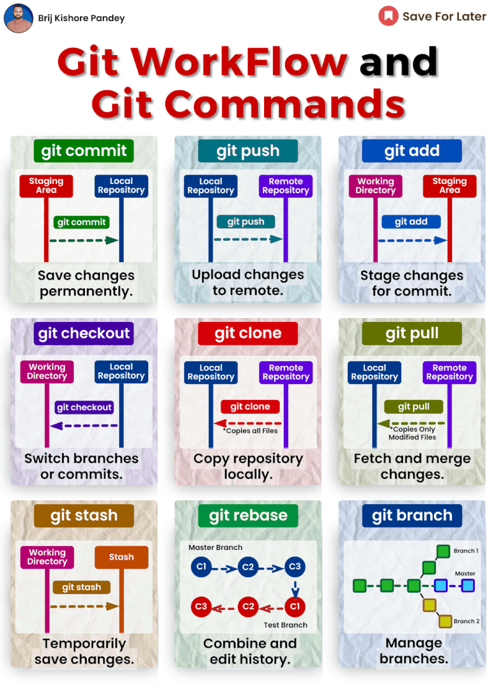

# 𝗧𝗼𝗽 𝗚𝗶𝘁 𝗖𝗼𝗺𝗺𝗮𝗻𝗱𝘀 👨‍💻

✨ 𝗚𝗲𝘁𝘁𝗶𝗻𝗴 & 𝗖𝗿𝗲𝗮𝘁𝗶𝗻𝗴 𝗣𝗿𝗼𝗷𝗲𝗰𝘁𝘀
- 𝚐𝚒𝚝 𝚒𝚗𝚒𝚝: Kickstart a new git repository.
- 𝚐𝚒𝚝 𝚌𝚕𝚘𝚗𝚎 [𝚞𝚛𝚕]: Duplicate a repository into a new directory.

📸 𝗕𝗮𝘀𝗶𝗰 𝗦𝗻𝗮𝗽𝘀𝗵𝗼𝘁𝘁𝗶𝗻𝗴
- 𝚐𝚒𝚝 𝚜𝚝𝚊𝚝𝚞𝚜: Display the current tree status.
- 𝚐𝚒𝚝 𝚊𝚍𝚍 [𝚏𝚒𝚕𝚎]: Prepare file contents for the next commit.
- 𝚐𝚒𝚝 𝚊𝚍𝚍 .: Stage all current changes for commit.
- 𝚐𝚒𝚝 𝚌𝚘𝚖𝚖𝚒𝚝 -𝚖 "[𝚖𝚎𝚜𝚜𝚊𝚐𝚎]": Snapshot your changes with a narrative.

🌿 𝗕𝗿𝗮𝗻𝗰𝗵𝗶𝗻𝗴 & 𝗠𝗲𝗿𝗴𝗶𝗻𝗴
- 𝚐𝚒𝚝 𝚋𝚛𝚊𝚗𝚌𝚑: Navigate, establish, or remove branches.
- 𝚐𝚒𝚝 𝚌𝚑𝚎𝚌𝚔𝚘𝚞𝚝 [𝚋𝚛𝚊𝚗𝚌𝚑-𝚗𝚊𝚖𝚎]: Switch branches or paths.
- 𝚐𝚒𝚝 𝚌𝚑𝚎𝚌𝚔𝚘𝚞𝚝 -𝚋 [𝚋𝚛𝚊𝚗𝚌𝚑-𝚗𝚊𝚖𝚎]: Craft and move to a new branch.
- 𝚐𝚒𝚝 𝚖𝚎𝚛𝚐𝚎 [𝚋𝚛𝚊𝚗𝚌𝚑]: Fuse a branch’s history into the present.
- 𝚐𝚒𝚝 𝚛𝚎𝚋𝚊𝚜𝚎 [𝚋𝚛𝚊𝚗𝚌𝚑]: Transplant commits to another base.

🔄 𝗦𝗵𝗮𝗿𝗶𝗻𝗴 & 𝗨𝗽𝗱𝗮𝘁𝗶𝗻𝗴 𝗣𝗿𝗼𝗷𝗲𝗰𝘁𝘀
- 𝚐𝚒𝚝 𝚙𝚞𝚜𝚑 [𝚊𝚕𝚒𝚊𝚜] [𝚋𝚛𝚊𝚗𝚌𝚑]: Send your local branch updates to the remote repository.
- 𝚐𝚒𝚝 𝚏𝚎𝚝𝚌𝚑 [𝚊𝚕𝚒𝚊𝚜]: Download changes from a remote repository.
- 𝚐𝚒𝚝 𝚙𝚞𝚕𝚕 [𝚊𝚕𝚒𝚊𝚜]: Download and integrate changes from a remote to your current branch.

🔍 𝗜𝗻𝘀𝗽𝗲𝗰𝘁𝗶𝗼𝗻 & 𝗖𝗼𝗺𝗽𝗮𝗿𝗶𝘀𝗼𝗻
- 𝚐𝚒𝚝 𝚕𝚘𝚐: Review previous commits.
- 𝚐𝚒𝚝 𝚕𝚘𝚐 --𝚜𝚞𝚖𝚖𝚊𝚛𝚢: Display a history of changes with detailed diffs.
- 𝚐𝚒𝚝 𝚍𝚒𝚏𝚏 [𝚏𝚒𝚛𝚜𝚝-𝚋𝚛𝚊𝚗𝚌𝚑]...[𝚜𝚎𝚌𝚘𝚗𝚍-𝚋𝚛𝚊𝚗𝚌𝚑]: Compare changes across branches.
- 𝚐𝚒𝚝 𝚜𝚑𝚘𝚠 [𝚌𝚘𝚖𝚖𝚒𝚝]: Examine various types of objects.

🗃️ 𝗦𝘁𝗮𝘀𝗵𝗶𝗻𝗴 & 𝗖𝗹𝗲𝗮𝗻𝗶𝗻𝗴
- 𝚐𝚒𝚝 𝚜𝚝𝚊𝚜𝚑: Safeguard your uncommitted changes.
- 𝚐𝚒𝚝 𝚜𝚝𝚊𝚜𝚑 𝚙𝚘𝚙: Reapply stashed changes.
- 𝚐𝚒𝚝 𝚜𝚝𝚊𝚜𝚑 𝚕𝚒𝚜𝚝: Overview of all stored stashes.
- 𝚐𝚒𝚝 𝚌𝚕𝚎𝚊𝚗 -𝚏: Purge untracked files from your working directory.

🐞 𝗗𝗲𝗯𝘂𝗴𝗴𝗶𝗻𝗴
- 𝚐𝚒𝚝 𝚋𝚒𝚜𝚎𝚌𝚝: Pinpoint the commit that introduced a bug.
- 𝚐𝚒𝚝 𝚋𝚕𝚊𝚖𝚎 [𝚏𝚒𝚕𝚎]: Identify who changed what and when in a file.

⚙️ 𝗔𝗱𝘃𝗮𝗻𝗰𝗲𝗱 𝗧𝗼𝗼𝗹𝘀
- 𝚐𝚒𝚝 𝚛𝚎𝚜𝚎𝚝 [𝚏𝚒𝚕𝚎]: Withdraw a staged file while keeping changes.
- 𝚐𝚒𝚝 𝚛𝚎𝚜𝚎𝚝 [𝚌𝚘𝚖𝚖𝚒𝚝]: Revert to a previous commit, erasing subsequent changes.
- 𝚐𝚒𝚝 𝚛𝚎𝚜𝚎𝚝 --𝚑𝚊𝚛𝚍 [𝚌𝚘𝚖𝚖𝚒𝚝]: Discard all changes up to a specified commit.
- 𝚐𝚒𝚝 𝚛𝚎𝚟𝚎𝚛𝚝 [𝚌𝚘𝚖𝚖𝚒𝚝]: Undo changes from a specific commit.

🏷️ 𝗧𝗮𝗴𝗴𝗶𝗻𝗴
- 𝚐𝚒𝚝 𝚝𝚊𝚐 [𝚌𝚘𝚖𝚖𝚒𝚝𝙸𝙳]: Label important points in your commit history.

🔄 𝗦𝘆𝗻𝗰𝗵𝗿𝗼𝗻𝗶𝘇𝗮𝘁𝗶𝗼𝗻 & 𝗥𝗲𝗺𝗼𝘁𝗲 𝗥𝗲𝗽𝗼𝘀𝗶𝘁𝗼𝗿𝗶𝗲𝘀
- 𝚐𝚒𝚝 𝚛𝚎𝚖𝚘𝚝𝚎 𝚊𝚍𝚍 [𝚊𝚕𝚒𝚊𝚜] [𝚞𝚛𝚕]: Connect a remote repository under a nickname.
- 𝚐𝚒𝚝 𝚏𝚎𝚝𝚌𝚑 [𝚊𝚕𝚒𝚊𝚜]: Pull down all changes from a remote.
- 𝚐𝚒𝚝 𝚙𝚞𝚜𝚑 [𝚊𝚕𝚒𝚊𝚜] [𝚋𝚛𝚊𝚗𝚌𝚑]: Share your branch commits with the remote.
- 𝚐𝚒𝚝 𝚙𝚞𝚕𝚕: Sync and merge updates from the remote branch.