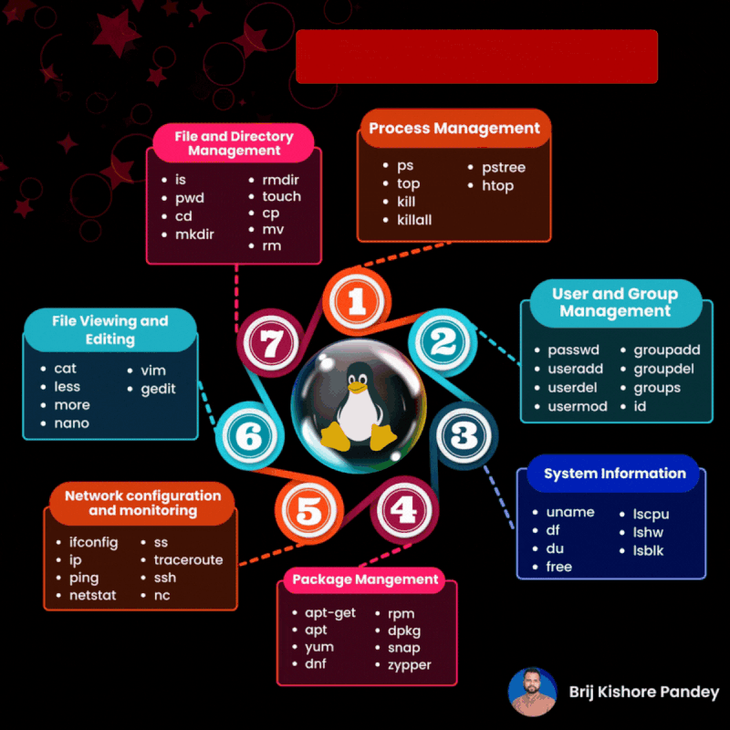

# Linux commands

📂 𝟭. 𝗙𝗶𝗹𝗲 𝗮𝗻𝗱 𝗗𝗶𝗿𝗲𝗰𝘁𝗼𝗿𝘆 𝗠𝗮𝗻𝗮𝗴𝗲𝗺𝗲𝗻𝘁 🗂️
- 𝚕𝚜: List files and directories in the current location
- 𝚙𝚠𝚍: Display the current working directory path
- 𝚌𝚍: Navigate between directories
- 𝚖𝚔𝚍𝚒𝚛: Create new directories
- 𝚛𝚖𝚍𝚒𝚛: Remove empty directories
- 𝚝𝚘𝚞𝚌𝚑: Create new files
- 𝚌𝚙: Duplicate files or directories
- 𝚖𝚟: Move or rename files and directories
- 𝚛𝚖: Delete files or directories

🔧 𝟮. 𝗣𝗿𝗼𝗰𝗲𝘀𝘀 𝗠𝗮𝗻𝗮𝗴𝗲𝗺𝗲𝗻𝘁
- 𝚙𝚜: View running processes
- 𝚝𝚘𝚙: Monitor active processes in real-time
- 𝚑𝚝𝚘𝚙: Interact with processes using a user-friendly interface
- 𝚔𝚒𝚕𝚕: Stop a specific process
- 𝚔𝚒𝚕𝚕𝚊𝚕𝚕: Terminate all occurrences of a process
- 𝚙𝚜𝚝𝚛𝚎𝚎: Visualize processes in a hierarchical tree structure 🌲

👥 𝟯. 𝗨𝘀𝗲𝗿 𝗮𝗻𝗱 𝗚𝗿𝗼𝘂𝗽 𝗠𝗮𝗻𝗮𝗴𝗲𝗺𝗲𝗻𝘁
- 𝚙𝚊𝚜𝚜𝚠𝚍: Update user passwords
- 𝚞𝚜𝚎𝚛𝚊𝚍𝚍: Create new users
- 𝚞𝚜𝚎𝚛𝚍𝚎𝚕: Remove users
- 𝚐𝚛𝚘𝚞𝚙𝚜: List groups a user belongs to
- 𝚞𝚜𝚎𝚛𝚖𝚘𝚍: Modify user account details
- 𝚒𝚍: Show user and group information
- 𝚐𝚛𝚘𝚞𝚙𝚊𝚍𝚍: Create new groups
- 𝚐𝚛𝚘𝚞𝚙𝚍𝚎𝚕: Remove groups

💾 𝟰. 𝗦𝘆𝘀𝘁𝗲𝗺 𝗜𝗻𝗳𝗼𝗿𝗺𝗮𝘁𝗶𝗼𝗻 🖥️
- 𝚞𝚗𝚊𝚖𝚎: Display system details
- 𝚍𝚏: Check disk space usage
- 𝚍𝚞: Estimate file and directory sizes
- 𝚏𝚛𝚎𝚎: Show available memory
- 𝚕𝚜𝚌𝚙𝚞: Provide CPU architecture information
- 𝚕𝚜𝚑𝚠: List hardware components
- 𝚕𝚜𝚋𝚕𝚔: Display block devices

🌐 𝟱. 𝗡𝗲𝘁𝘄𝗼𝗿𝗸 𝗖𝗼𝗻𝗳𝗶𝗴𝘂𝗿𝗮𝘁𝗶𝗼𝗻 𝗮𝗻𝗱 𝗠𝗼𝗻𝗶𝘁𝗼𝗿𝗶𝗻𝗴 🕸️
- 𝚒𝚏𝚌𝚘𝚗𝚏𝚒𝚐: Manage network interfaces
- 𝚒𝚙: Control routing, devices, and tunnels
- 𝚙𝚒𝚗𝚐: Verify network connectivity
- 𝚗𝚎𝚝𝚜𝚝𝚊𝚝: Analyze network statistics
- 𝚜𝚜: Investigate socket connections
- 𝚝𝚛𝚊𝚌𝚎𝚛𝚘𝚞𝚝𝚎: Track packet routes and delays
- 𝚜𝚜𝚑: Establish secure remote connections
- 𝚗𝚌: Swiss army knife for TCP/IP networking

📦 𝟲. 𝗣𝗮𝗰𝗸𝗮𝗴𝗲 𝗠𝗮𝗻𝗮𝗴𝗲𝗺𝗲𝗻𝘁 📥📤
- 𝚊𝚙𝚝-𝚐𝚎𝚝, 𝚊𝚙𝚝: Manage packages on Debian-based systems
- 𝚢𝚞𝚖, 𝚍𝚗𝚏: Handle packages on RPM-based systems
- 𝚛𝚙𝚖: Manage RPM packages
- 𝚍𝚙𝚔𝚐: Manage Debian packages
- 𝚜𝚗𝚊𝚙: Work with the universal Linux package system
- 𝚣𝚢𝚙𝚙𝚎𝚛: Manage packages on openSUSE

📜 𝟳. 𝗙𝗶𝗹𝗲 𝗩𝗶𝗲𝘄𝗶𝗻𝗴 𝗮𝗻𝗱 𝗘𝗱𝗶𝘁𝗶𝗻𝗴 📝
- 𝚌𝚊𝚝: Display file contents
- 𝚕𝚎𝚜𝚜: View files with navigation controls
- 𝚖𝚘𝚛𝚎: Another file viewing tool
- 𝚟𝚒𝚖: Use the powerful Vim text editor
- 𝚐𝚎𝚍𝚒𝚝: Edit files using the GNOME text editor
- 𝚗𝚊𝚗𝚘: Edit files with the user-friendly Nano editor

Credits : Brij kishore Pandey