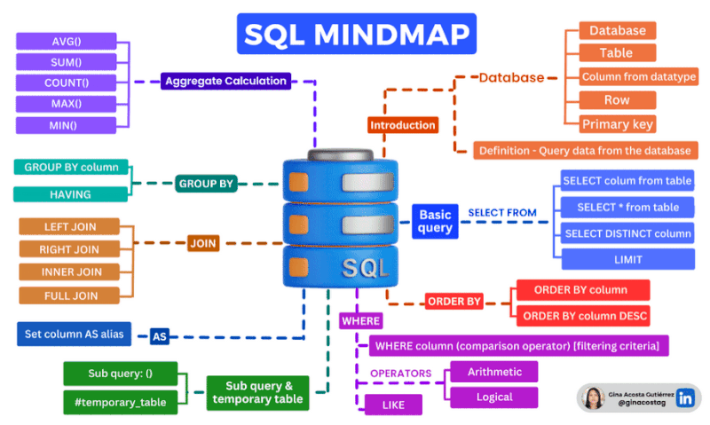

# Mastering SQL: Your Data Compass

SQL is the language that helps professionals navigate the seas of data with precision and skill.

Aggregate Functions: With AVG(), SUM(), COUNT(), MAX(), and MIN(), transform raw data into meaningful metrics. These functions are the cornerstone of data analysis, allowing us to quantify performance and identify trends.

Joins: Seamlessly integrate disparate data sources. LEFT JOIN, RIGHT JOIN, INNER JOIN, and FULL JOIN are the tools that enable comprehensive data relationships, providing a multidimensional view of our datasets.

Query Essentials: SELECT FROM forms the foundation of data queries, allowing for the extraction of valuable information. To refine our insights, we use SELECT DISTINCT to eliminate duplicates and LIMIT to focus on specific data segments.

Group and Filter: GROUP BY clusters data based on shared attributes, while HAVING filters these groups to meet specific criteria. This dual functionality organizes data into subsets for detailed examination.

Subqueries: These are the building blocks for complex analyses, breaking down daunting data sets into manageable pieces, much like creating a blueprint before construction.

SQL is not just a technical skill; it's an essential tool for making data-driven decisions in today's information-rich environment.