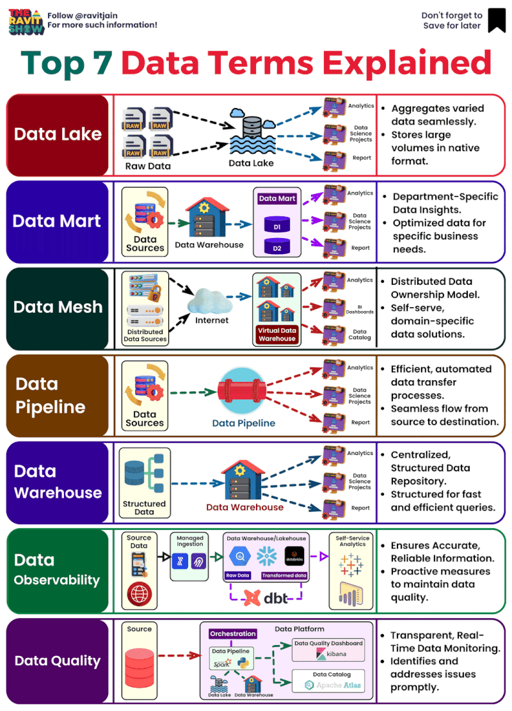

#  𝐓𝐨𝐩 7 𝐃𝐚𝐭𝐚 𝐓𝐞𝐫𝐦𝐬 𝐄𝐱𝐩𝐥𝐚𝐢𝐧𝐞𝐝

EBook : https://lnkd.in/df5PeUxG

1️⃣ 𝗗𝗮𝘁𝗮 𝗪𝗮𝗿𝗲𝗵𝗼𝘂𝘀𝗲: A data warehouse is a centralized repository of data that is used for analysis and reporting. It is typically used to store historical data, but can also store real-time data. Data warehouses are typically structured, meaning that the data is organized in a way that makes it easy to query and analyze.🏢

2️⃣ 𝗗𝗮𝘁𝗮 𝗠𝗮𝗿𝘁: A data mart is a subset of a data warehouse. It's designed to cater to the needs of a specific business unit or team. Think of it as a department store within the larger shopping mall (the data warehouse).🏪

3️⃣ 𝗗𝗮𝘁𝗮 𝗟𝗮𝗸𝗲: A data lake is a repository for all of an organization's data, both structured and unstructured. It is a more flexible and scalable solution than a data warehouse, as it can store any type of data, regardless of its structure. Data lakes are typically used for big data analytics, as they can store and process large amounts of data quickly and efficiently..🌊

4️⃣ 𝗗𝗲𝗹𝘁𝗮 𝗟𝗮𝗸𝗲: Delta Lake is a data lake storage layer that provides a unified view of data across multiple data lakes. It is a relatively new technology, but it has quickly become popular due to its ability to provide a consistent view of data in a data lake.

• ACID transactions
• Data versioning
• Automatic compaction🛠️

5️⃣ 𝗗𝗮𝘁𝗮 𝗣𝗶𝗽𝗲𝗹𝗶𝗻𝗲: A data pipeline is the process of moving data from one location to another, often involving steps for extracting, transforming, and loading data (ETL). It's like the conveyer belt in a factory, ensuring that the data gets to where it's needed in a usable form.🚀

6️⃣ 𝗗𝗮𝘁𝗮 𝗠𝗲𝘀𝗵: Data Mesh is an architectural paradigm that treats data as a product. It decentralizes data ownership and architecture, allowing teams to develop, govern, and operate their own data domains. It's a shift from monolithic, centralized data management to a more distributed approach.🕸️