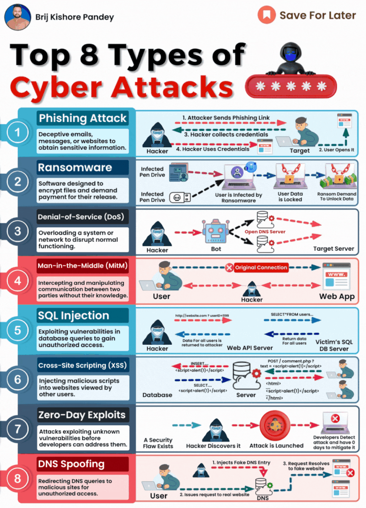

# Top 8 Types Of Cyber Attacks

As technology becomes the backbone of every business, having a solid grasp of core cybersecurity concepts is a must-have skill for all IT professionals.

But what exactly should you focus on? Here are the key areas that can make or break your organization's security:

1. 🎣 Phishing – Don't take the bait! Recognizing phishing scams can save you from costly data breaches that can tarnish your reputation.

2. 💸 Ransomware – Hold onto your data and your wallet! Understanding ransomware tactics ensures business continuity and protects you from financial losses.

3. ⚠️ Denial-of-Service (DoS) – Keep your services up and running! Knowing how to handle DoS attacks is crucial for maintaining customer trust.

4. 👥 Man-in-the-Middle (MitM) – Protect your secret conversations! Awareness of MitM attacks safeguards your confidential communications.

5. 💉 SQL Injection – Secure your data's home! Expertise in preventing SQL injection protects your database, the backbone of your digital infrastructure.

6. 🕷️ Cross-Site Scripting (XSS) – Don't let your website become a hacker's playground! For web developers, understanding XSS threats is essential for application integrity.

7. 🎯 Zero-Day Exploits – Stay one step ahead! Knowledge of potential zero-day exploits encourages proactive security and constant vigilance.

8. 🕵️‍♂️ DNS Spoofing – Don't fall for identity theft! Grasping DNS spoofing risks prevents misdirection leading to data theft and unauthorized access.

As IT professionals, we are the guardians of the digital realm.

It's our responsibility to understand and mitigate these top cyber risks to keep our digital ecosystem safe and secure.

But learning never stops!

Ongoing education in this crucial discipline is the key to staying ahead of the game.