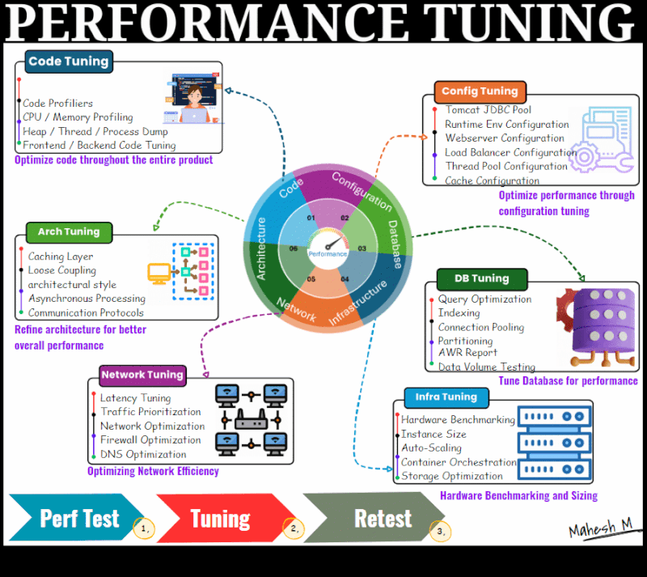

# Performance Turning 

They are complaining of slowness, but it's fast for me

A very familiar conversation that we all would have heard

To ensure optimal product performance, thorough tuning and optimization are essential. We must concentrate on key areas for performance enhancement, categorized as follows:

1. **Code Tuning:**
- Optimization of code across the entire product is crucial. Leverage code profilers to identify and optimize code segments. Assess for memory leaks, CPU optimization, and resource consumption concerns.

2. **Configuration Tuning:**
- Fine-tune configurations system-wide. Experiment, test, and optimize settings like Tomcat/WebLogic JDBC and thread pools. Proper configuration with optimal values is vital for overall product performance.

3. **Database Tuning:**
- Optimizes the database by fine-tuning SQL queries, indexing, and connection pooling. Utilize tools like Oracle's AWR report for in-depth analysis and fine-tuning.

4. **Infrastructure Tuning:**
- Benchmark hardware and instance sizes to align with the workload. Determine CPU and RAM requirements and the number of Kubernetes pods needed and ensure they meet workload and SLA expectations. This process involves planning, testing, tuning, and retesting.

5. **Architecture Tuning:**
- Evaluate the architecture and consider changes such as incorporating a CDN for improved performance across various locations or implementing a queuing system to enhance performance in specific areas."

6. **Network Tuning:**
- Focuses on vital aspects in today's distributed systems, addressing issues such as DNS, protocols, latency, and firewall tuning. Optimization efforts should target effective tuning for better performance, especially when the database is situated in one region and customers are in another.
