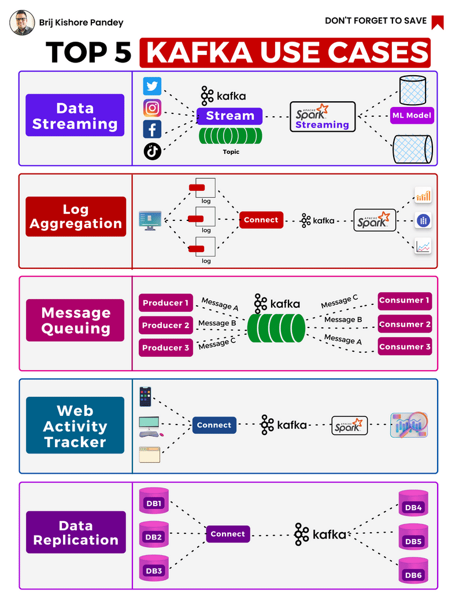

# 𝗞𝗮𝗳𝗸𝗮 𝗨𝘀𝗲 𝗖𝗮𝘀𝗲𝘀

## 𝗪𝗵𝗮𝘁 𝗶𝘀 𝗞𝗮𝗳𝗸𝗮?

Apache Kafka is a distributed, fault-tolerant, and highly scalable pub-sub messaging system. It enables applications to both publish and subscribe to real-time data feeds, boasting high throughput for both producers and consumers of record streams, and facilitating the real-time processing of these data streams.

## 𝗪𝗵𝗮𝘁 𝗶𝘀 𝗞𝗮𝗳𝗸𝗮 𝗦𝘁𝗿𝗲𝗮𝗺𝗶𝗻𝗴?

Kafka Streams is a powerful client library for stream processing, deeply integrated with Apache Kafka. It allows for the transformation and analysis of data stored in Kafka topics.

## 𝗞𝗮𝗳𝗸𝗮 𝘃𝘀. 𝗭𝗲𝗿𝗼-𝗖𝗼𝗽𝘆 𝗞𝗮𝗳𝗸𝗮: 𝗗𝗶𝘀𝘁𝗶𝗻𝗰𝘁 𝗙𝗲𝗮𝘁𝘂𝗿𝗲𝘀

Traditional Kafka is renowned for its rapid data processing capabilities. However, 'zero-copy' Kafka enhances this further by utilizing an optimized data transfer mechanism. It circumvents the traditional application layer, transferring data directly from the file system cache to the network socket buffer. This minimizes CPU overhead and reduces data copying (hence 'zero-copy'), resulting in significantly improved throughput and reduced latency. Essentially, Zero-Copy Kafka provides an accelerated version of Kafka, tailored for even more efficient data handling.

## 𝗧𝗼𝗽 𝟱 𝗞𝗮𝗳𝗸𝗮 𝗨𝘀𝗲 𝗖𝗮𝘀𝗲𝘀:

### 1. 𝗗𝗮𝘁𝗮 𝗦𝘁𝗿𝗲𝗮𝗺𝗶𝗻𝗴: 
Kafka acts as a real-time conduit for high-volume data streams, analogous to channeling a dynamic river of information. It empowers the creation of applications that are capable of immediate data transformation and reaction as the information flows between various systems.

### 2. 𝗟𝗼𝗴 𝗔𝗴𝗴𝗿𝗲𝗴𝗮𝘁𝗶𝗼𝗻: 
Kafka addresses the challenge of managing colossal volumes of log data generated every second. It provides a unified, high-throughput, and low-latency platform for handling real-time data feeds, thereby becoming an optimal solution for efficient log aggregation in distributed system architectures.

### 3. 𝗠𝗲𝘀𝘀𝗮𝗴𝗲 𝗤𝘂𝗲𝘂𝗲: 
In modern architectures, particularly those employing microservices, Kafka serves as an advanced message queuing system. It offers significant advantages over traditional message queues, with its inherent scalability, built-in fault tolerance, replication capabilities, and high durability.

### 4. 𝗪𝗲𝗯 𝗔𝗰𝘁𝗶𝘃𝗶𝘁𝘆 𝗧𝗿𝗮𝗰𝗸𝗶𝗻𝗴: 
Kafka is adept at meticulously tracking web activities such as page views, searches, and uploads, in a real-time and large-scale manner. It acts as a continuous monitor of user interactions on websites, providing invaluable insights for user experience enhancements.

### 5. 𝗗𝗮𝘁𝗮 𝗥𝗲𝗽𝗹𝗶𝗰𝗮𝘁𝗶𝗼𝗻:
 Kafka plays a pivotal role in the reliable and consistent transfer of data between different systems. It acts as a robust and fault-tolerant medium, ensuring seamless data replication and synchronization across distributed systems.