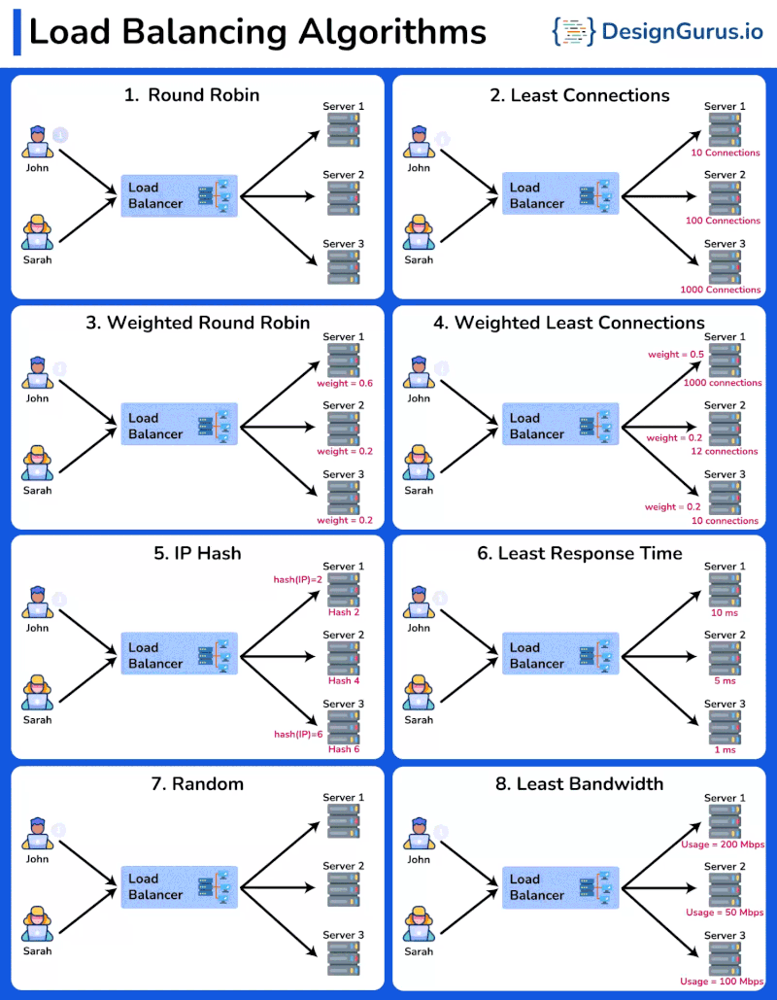

# 𝟖 𝐌𝐮𝐬𝐭 𝐊𝐧𝐨𝐰 𝐋𝐨𝐚𝐝 𝐁𝐚𝐥𝐚𝐧𝐜𝐢𝐧𝐠 𝐀𝐥𝐠𝐨𝐫𝐢𝐭𝐡𝐦𝐬

1. Round Robin
It assigns a request to the first server, then moves to the second, third, and so on, and after reaching the last server, it starts again at the first.

2. Least Connections
The Least Connections algorithm directs incoming requests to the server with the lowest number of active connections.

3. Weighted Round Robin
It assigns different weights to servers based on their capacities and distributes requests proportionally to these weights.

4. Weighted Least Connections
The Weighted Least Connections algorithm combines the Least Connections and Weighted Round Robin algorithms. It directs incoming requests to the server with the lowest ratio of active connections to assigned weight.

5. IP Hash
The IP Hash algorithm determines the server to which a request should be sent based on the source and/or destination IP address. This method maintains session persistence, ensuring that requests from a specific user are directed to the same server.

6. Least Response Time
It directs incoming requests to the server with the lowest response time and the fewest active connections.

7. Random
It directs incoming requests to a randomly selected server from the available pool.

8. Least Bandwidth
It directs incoming requests to the server currently utilizing the least amount of bandwidth. This approach helps to ensure that servers are not overwhelmed by network traffic.

