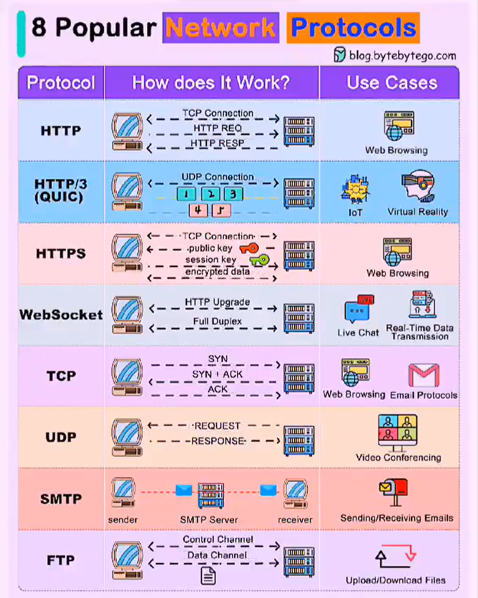

# 𝟴 𝗣𝗼𝗽𝘂𝗹𝗮𝗿 𝗡𝗲𝘁𝘄𝗼𝗿𝗸 𝗣𝗿𝗼𝘁𝗼𝗰𝗼𝗹𝘀🔰

## 𝐇𝐓𝐓𝐏 (𝐇𝐲𝐩𝐞𝐫𝐭𝐞𝐱𝐭 𝐓𝐫𝐚𝐧𝐬𝐟𝐞𝐫 𝐏𝐫𝐨𝐭𝐨𝐜𝐨𝐥)

This is like the language websites and browsers use to talk to each other.

When you click on a link or type a website address, HTTP helps fetch the web page for you to see.

## 𝐇𝐓𝐓𝐏/𝟑
Think of this as an upgraded version of HTTP.

It's designed to make web browsing faster and more efficient by using a special technology called QUIC.

This means websites load quicker, videos stream smoother, and your online experience becomes fast.

## 𝐇𝐓𝐓𝐏𝐒 (𝐇𝐲𝐩𝐞𝐫𝐭𝐞𝐱𝐭 𝐓𝐫𝐚𝐧𝐬𝐟𝐞𝐫 𝐏𝐫𝐨𝐭𝐨𝐜𝐨𝐥 𝐒𝐞𝐜𝐮𝐫𝐞)
Just like HTTP, but with an extra layer of #security.

HTTPS encrypts the data that travels between your browser and the website you're visiting.

This encryption helps keep your sensitive information, like passwords and credit card details, safe from hackers.

## 𝐖𝐞𝐛𝐒𝐨𝐜𝐤𝐞𝐭
WebSocket is the protocol that enables real-time communication between your browser and server, making interactions seamless.

It's what makes live chats, real-time updates, and interactive web applications possible.

## 𝐓𝐂𝐏 (𝐓𝐫𝐚𝐧𝐬𝐦𝐢𝐬𝐬𝐢𝐨𝐧 𝐂𝐨𝐧𝐭𝐫𝐨𝐥 𝐏𝐫𝐨𝐭𝐨𝐜𝐨𝐥)
When you send an email or browse the web, TCP ensures that data reaches its destination reliably and in the right order.

It handles things like error detection, flow control, and data sequencing to make sure your online activities run smoothly.

## 𝐔𝐃𝐏 (𝐔𝐬𝐞𝐫 𝐃𝐚𝐭𝐚𝐠𝐫𝐚𝐦 𝐏𝐫𝐨𝐭𝐨𝐜𝐨𝐥)
UDP is like the fast lane of the internet.

It's great for apps that need speed and don't mind if some data gets lost along the way.

Video streaming, online gaming, and voice calls often use UDP to deliver real-time experiences without delays.

## 𝐒𝐌𝐓𝐏 (𝐒𝐢𝐦𝐩𝐥𝐞 𝐌𝐚𝐢𝐥 𝐓𝐫𝐚𝐧𝐬𝐟𝐞𝐫 𝐏𝐫𝐨𝐭𝐨𝐜𝐨𝐥)
Sending and receiving emails relies on SMTP.

It's the protocol that mail servers use to communicate & transfer emails across the #internet.

So, every time you hit send on an email, SMTP kicks into action to deliver.

## 𝐅𝐓𝐏 (𝐅𝐢𝐥𝐞 𝐓𝐫𝐚𝐧𝐬𝐟𝐞𝐫 𝐏𝐫𝐨𝐭𝐨𝐜𝐨𝐥)
Need to upload/download files from a server? That's where FTP comes in.

It's a protocol specifically designed for transferring files between computers over network.