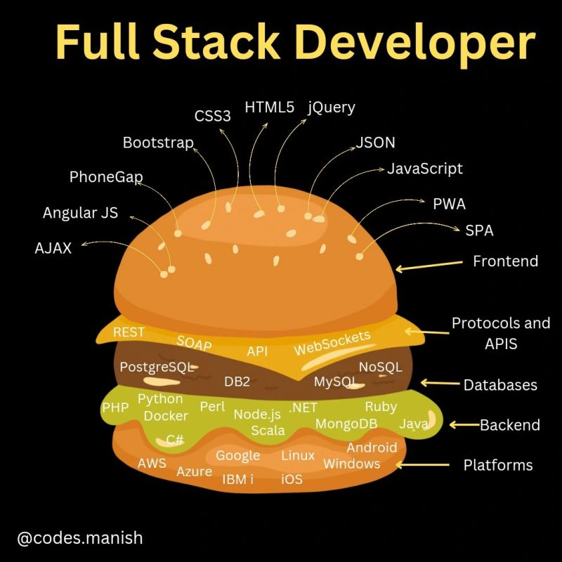

# 𝐅𝐫𝐞𝐞 𝐂𝐞𝐫𝐭𝐢𝐟𝐢𝐜𝐚𝐭𝐢𝐨𝐧𝐬

1. Data Science:https://lnkd.in/dTcrzzvv
2. React: https://lnkd.in/dRy7piDR
3. Angular: https://lnkd.in/dxyd7iW2
4. SEO: https://lnkd.in/dNRfAg2H
5. Digital Marketing from Google: https://lnkd.in/d5B2gpzf
6. Cloud Security: https://lnkd.in/dBY5hMgg
7. Web Dev (HTML and CSS): https://lnkd.in/d_hcSBGr
8. Python: https://lnkd.in/gMizg4SB
9. JavaScript https://lnkd.in/dabj4Vta
10. DevOps https://lnkd.in/dvUGR3T6
11. Machine Learning https://lnkd.in/dkk-Fd_z
12. Java https://lnkd.in/dxZna5nK
13. C++ https://lnkd.in/dNSSQUaK
14. Go https://lnkd.in/d3Y7Djqw
15. Neo4j Certified Professional https://lnkd.in/dDcGS5sR
16. Redis Certified Developer https://lnkd.in/dK4p6Drw
17. MongoDB https://lnkd.in/dcnZWMRx
18. Backend Development https://lnkd.in/dpETNPwt
19. SQL https://lnkd.in/dn5phvuA
20. C# https://lnkd.in/dzew6Rz8
21. SQL for Data Science : imp.i384100.net/q4XoeN
22. Databases : imp.i384100.net/9gaqbj
23. Google Data Analytics : imp.i384100.net/JzWrLR
24. Machine Learning Specialization : imp.i384100.net/xkDR23
25. Deep Learning Specialization: imp.i384100.net/jrABPv
26. Google Cybersecurity : imp.i384100.net/XY3KEa
27. Generative AI for Everyone : imp.i384100.net/y2AR1b
28. AI For Everyone : imp.i384100.net/Mm3E5q
29. Blockchain Specialization : imp.i384100.net/k0Ejq3
30. IBM Data Science : imp.i384100.net/Vm3066

# Free Certifications for a Full-Stack Career in 2024

1. Full Stack : https://lnkd.in/dKw63ZWN
2. HTML and CSS : https://lnkd.in/d_hcSBGr
3. JavaScript : https://lnkd.in/d923AgU5
4. Python : https://lnkd.in/dGdVkx-C
5. MySQL : https://lnkd.in/gQV5idDv
6. MongoDB : https://lnkd.in/datQ53t9
7. Node.js : https://lnkd.in/gRZ7Kg82
8. Express : https://lnkd.in/d3enke4W
9. React : https://lnkd.in/dCp9KRN5
10. Java : https://lnkd.in/gpZBQyfr
11. Git : https://lnkd.in/dGJ4NYe8
12. DSA : https://lnkd.in/g3ck8V9c
13. GraphQL : https://lnkd.in/deJKmwyt
14. Microservices : https://lnkd.in/d-vp4Bti
15. Cloud : https://lnkd.in/deAzQzvB
16. Serverless : https://lnkd.in/d6G_jkHE
17. Linux : https://lnkd.in/dwDQmvJe
18. DevOps, CI/CD : https://lnkd.in/dn8f_7Jf
19. Docker : https://lnkd.in/dUJWqkJT
20. Kubernetes, OpenShift : https://lnkd.in/dsVgn8en
21. Front-End Development : https://lnkd.in/dVxSqnvX
22. Databases : https://lnkd.in/dZEg7adW
23. Back-End Development : https://lnkd.in/dRBQPsHV
24. The Full Stack Course : https://lnkd.in/d-YEFE74
25. Web Design for Everybody: Basics of Web Development & Coding Specialization : https://lnkd.in/dMGPSg8W
26. Introduction to Web Development with HTML, CSS, JavaScript : https://lnkd.in/dtCT5CAQ
27. Introduction to Web Development :  IBM Full Stack Software Developer Professional Certificate : https://lnkd.in/d_wA7bRd
29. IBM DevOps and Software Engineering Professional Certificate : https://lnkd.in/d-KBCzsy
30. Meta Android Developer Professional Certificate : https://lnkd.in/dcvd6cS3