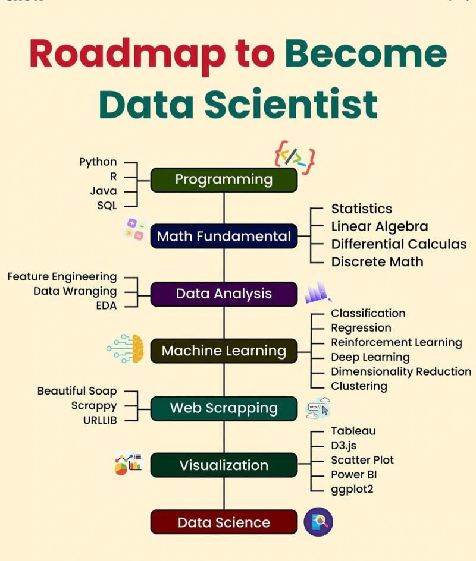
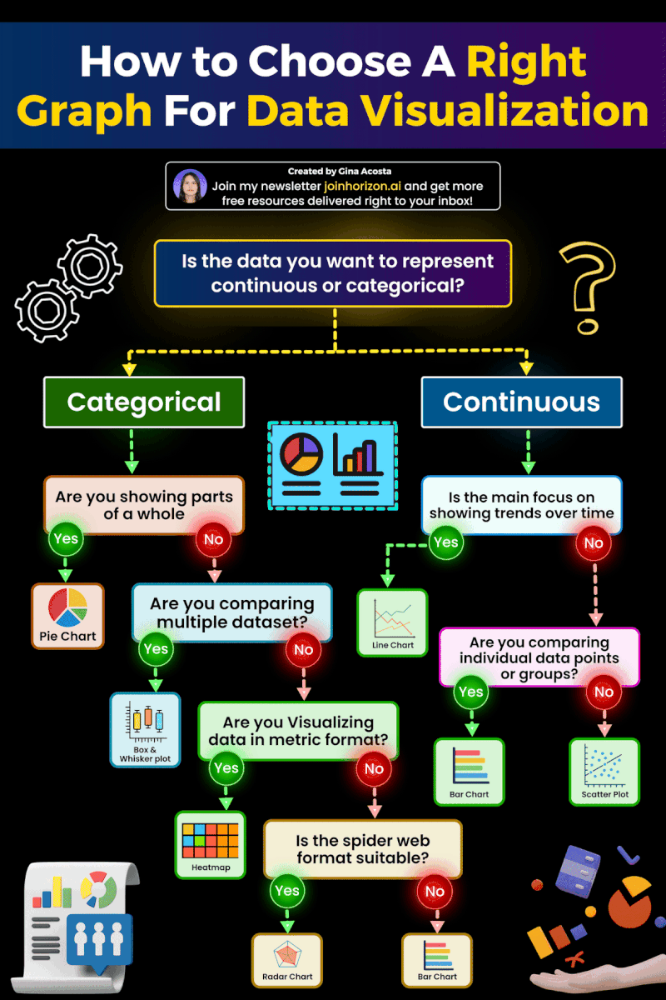

# Data Scientist 

 

## Python

1. Notes👉 https://learnpython.org
1. For Data Science & AI👉 https://lnkd.in/ddptfRha
1. Crash Course👉 https://lnkd.in/d5riX4ie
1. Specialization 👉 https://lnkd.in/d_6jwkrR

## SQL

1. SQL for Data Science 👉 https://lnkd.in/dcmJr_7N
1. Introduction 👉https://lnkd.in/dJuyfc7t
1. Retrieve Data Using SQL 👉 https://lnkd.in/dEtMvGDp

## R

1. Data Analysis with R👉 https://lnkd.in/deGxe-pN
1. Introduction 👉 https://lnkd.in/d-St_EvQ
1. R for Data Science👉 https://lnkd.in/dAmCdGzZ

## PowerBI

1. Intro: https://lnkd.in/dWzQn6JP
1. For Data Analyst: https://lnkd.in/dMhWtX_e

## Mathematics

1. Calculas 👉 https://lnkd.in/dBrtCDVX
1. MathWorks 👉 https://lnkd.in/dxabp8c7

## Tableau

1. Intro 👉 https://lnkd.in/dYSKQYYm

## Excel and PowerBI

1. Excel for Data Analytics 👉https://lnkd.in/dAeWGZ77
1. Business Analytics👉 https://lnkd.in/dyR5aqBF

## Others
1. Probability : https://lnkd.in/dDy9xrWz
1. Statistics : https://lnkd.in/dGwAMiGY
1. Linear Algebra : https://lnkd.in/dEeeJ9bW
1. Machine Learning
    1. Specialization: https://lnkd.in/davxxhiS
    1. with Python: https://lnkd.in/d46GH7Ms
    1. Certificate: https://lnkd.in/dx9qSjE8
1. Deep Learning
    1. Introduction 👉 https://lnkd.in/dCCjRfTc
    1. Neural Networks👉 https://lnkd.in/d3kS6-KV
1. Data Analysis
    1. Intro: https://lnkd.in/dSSYSVHm
    1. Google Data Analytics: https://lnkd.in/d74aQ7UR
    1. IBM Data Analyst: https://lnkd.in/dzJcY38B
1. Data Visualization
    1. Introduction 👉 https://lnkd.in/dqHFbbQx
    1. Data Science: Visualization 👉 https://lnkd.in/dv2a2J8e
1. Python for Data Science : https://lnkd.in/dXwP6qgf

## Free Data Science Resources 

1.  https://lnkd.in/dRTHUSxE

# Here are the best FREE Data Science books. 👇🏽

1. Dive into Deep Learning: https://d2l.ai
1. Deep Learning: deeplearningbook.org
1. Interpretable Machine Learning: https://lnkd.in/grevvJhu
1. Machine Learning Yearning: https://lnkd.in/gviDYyf9
1. Mathematics for Machine Learning: https://mml-book.github.io
1. An Introduction to Statistical Learning: https://statlearning.com

# Data Visualization 

 

|Sno.| Title | Link |
|--|--|--|
|𝟭|𝗛𝗼𝘄 𝘁𝗼 𝘁𝘂𝗿𝗻 𝗱𝗮𝘁𝗮 𝗶𝗻𝘁𝗼 𝘀𝘁𝗼𝗿𝗶𝗲𝘀 - 𝗕𝗲𝘀𝘁-𝘀𝗲𝗹𝗹𝗶𝗻𝗴 𝗮𝘂𝘁𝗵𝗼𝗿 𝗖𝗼𝗹𝗲 𝗡𝘂𝘀𝘀𝗯𝗮𝘂𝗺𝗲𝗿 𝗞𝗻𝗮𝗳𝗹𝗶𝗰 | https://lnkd.in/eztgahUP |
|𝟮|𝗧𝗵𝗲 𝗔𝗿𝘁 𝗼𝗳 𝗕𝘂𝘀𝗶𝗻𝗲𝘀𝘀 𝗦𝘁𝗼𝗿𝘆𝘁𝗲𝗹𝗹𝗶𝗻𝗴 - 𝗧𝗮𝗹𝗸𝘀 𝗮𝘁 𝗚𝗼𝗼𝗴𝗹𝗲|https://lnkd.in/eaWvehrv|
|𝟯|𝗦𝘁𝗼𝗿𝘆 𝗧𝗲𝗹𝗹𝗶𝗻𝗴 𝗜𝗻 𝗕𝘂𝘀𝗶𝗻𝗲𝘀𝘀 - 𝗣𝗶𝘅𝗮𝗿 𝗦𝘁𝗼𝗿𝘆 𝗧𝗲𝗹𝗹𝗲𝗿 𝗠𝗮𝘁𝗵𝗲𝘄 𝗟𝘂𝗵𝗻 𝗮𝘁 𝗖𝗜𝗠𝗖|https://lnkd.in/eTWwvxnf|
|𝟰|𝗩𝗶𝘀𝘂𝗮𝗹𝗶𝘇𝗮𝘁𝗶𝗼𝗻 𝗮𝗻𝗱 𝗦𝘁𝗼𝗿𝘆𝘁𝗲𝗹𝗹𝗶𝗻𝗴 𝗨𝘀𝗶𝗻𝗴 𝗗𝗮𝘁𝗮 - 𝗖𝗼𝗹𝘂𝗺𝗯𝗶𝗮 𝗘𝗻𝗴𝗶𝗻𝗲𝗲𝗿𝗶𝗻𝗴 𝗘𝘅𝗲𝗰𝘂𝘁𝗶𝘃𝗲 𝗘𝗱𝘂𝗰𝗮𝘁𝗶𝗼𝗻|https://lnkd.in/e3cVjssn|
|𝟱|𝗗𝗮𝘁𝗮 𝗦𝘁𝗼𝗿𝘆𝘁𝗲𝗹𝗹𝗶𝗻𝗴: 𝗛𝗼𝘄 𝘁𝗼 𝗧𝘂𝗿𝗻 𝗗𝗮𝘁𝗮 𝗶𝗻𝘁𝗼 𝗗𝗲𝗰𝗶𝘀𝗶𝗼𝗻𝘀 - 𝗛𝗲𝗶𝗻𝗿𝗶𝗰𝗵 𝗥𝘂𝘀𝗰𝗵𝗲 (𝗘𝘅-𝗠𝗰𝗞𝗶𝗻𝘀𝗲𝘆) | https://lnkd.in/eq_FSMbv|
|𝟲|𝗦𝘁𝗼𝗿𝘆𝘁𝗲𝗹𝗹𝗶𝗻𝗴 𝘄𝗶𝘁𝗵 𝗗𝗮𝘁𝗮 (𝗖𝗼𝗹𝗲 𝗡𝘂𝘀𝘀𝗯𝗮𝘂𝗺𝗲𝗿 𝗞𝗻𝗮𝗳𝗹𝗶𝗰) - 𝗧𝗮𝗹𝗸𝘀 𝗮𝘁 𝗚𝗼𝗼𝗴𝗹𝗲|https://lnkd.in/ecjutQ_9|
|𝟳|𝗦𝘁𝗼𝗿𝘆𝘁𝗲𝗹𝗹𝗶𝗻𝗴 𝘄𝗶𝘁𝗵 𝗧𝗮𝗯𝗹𝗲𝗮𝘂: 𝗕𝗲𝗰𝗼𝗺𝗲 𝗮 𝗗𝗮𝘁𝗮 𝗩𝗶𝘀𝘂𝗮𝗹𝗶𝘀𝗮𝘁𝗶𝗼𝗻 𝗥𝗼𝗰𝗸𝘀𝘁𝗮𝗿|https://lnkd.in/e3im__aB|
|𝟴|𝗗𝗮𝘁𝗮 𝗦𝘁𝗼𝗿𝘆𝘁𝗲𝗹𝗹𝗶𝗻𝗴 𝘄𝗶𝘁𝗵 𝗣𝗼𝘄𝗲𝗿 𝗕𝗜 | https://lnkd.in/eAkGVg6V|
|𝟵|𝗖𝗿𝗮𝗳𝘁𝗶𝗻𝗴 𝗦𝘁𝗼𝗿𝗶𝗲𝘀 𝘄𝗶𝘁𝗵 𝗗𝗮𝘁𝗮 - 𝗚𝗼𝗼𝗴𝗹𝗲 𝗗𝗮𝘁𝗮 𝗔𝗻𝗮𝗹𝘆𝘁𝗶𝗰𝘀 | https://lnkd.in/eCGTYnAe|