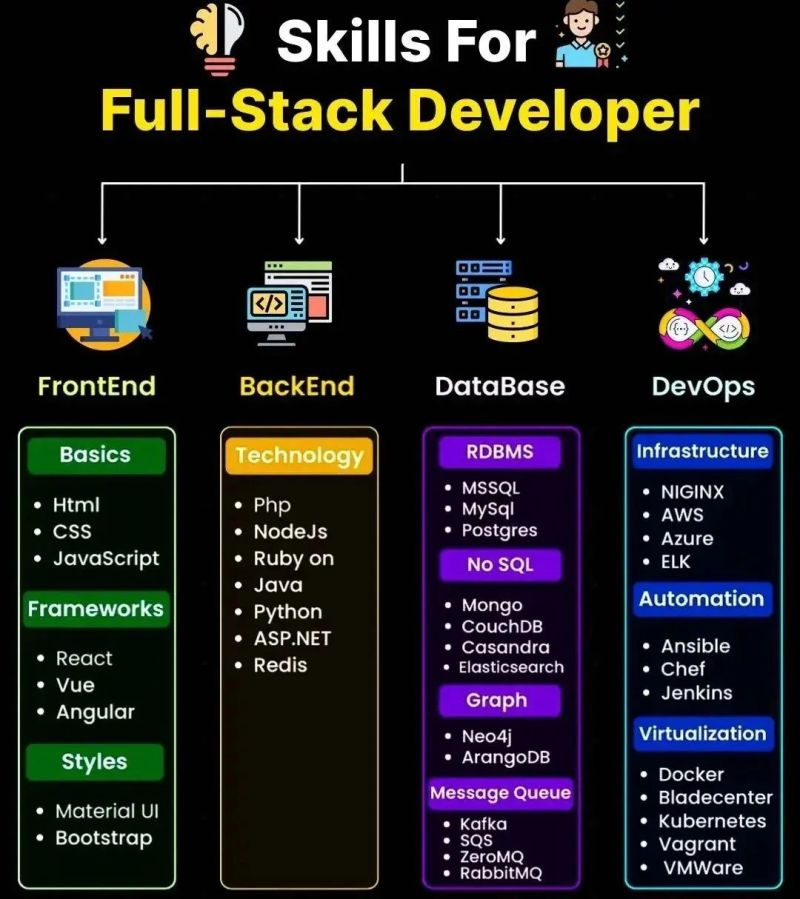

# Full Stack Developer 

1. Meta Front-End Developer Professional Certificate : https://lnkd.in/dwMu77M9
2. IBM Full Stack Software Developer Professional Certificate : https://lnkd.in/d_wA7bRd
3. HTML, CSS, and Javascript for Web Developers : https://lnkd.in/dPAifJE4
4. Introduction to User Experience Design : https://lnkd.in/d-4uWgpJ
5. Design a User Experience for Social Good & Prepare for Jobs : https://lnkd.in/dWjH9tNh
6. Google IT Support Professional Certificate : https://lnkd.in/dTpvrPfS
7. Foundations of User Experience (UX) Design : https://lnkd.in/de2zBxKe
8. Front-End Developer Capstone : https://lnkd.in/dXUKsdk4
9. Web Design for Everybody: Basics of Web Development & Coding Specialization : https://lnkd.in/dMGPSg8W
10. Search Engine Optimization (SEO) Specialization : https://lnkd.in/dP4PqJ2Z
11. Introduction to Web Development with HTML, CSS, JavaScript : https://lnkd.in/dtCT5CAQ
12. Programming with JavaScript : https://lnkd.in/dSQdwmUC
13. Introduction to Web Development : https://lnkd.in/dDMhvJqQ
14. Web Applications for Everybody Specialization : https://lnkd.in/dgi6ivjK
15. Meta Android Developer Professional Certificate : https://lnkd.in/dcvd6cS3
16. IBM DevOps and Software Engineering Professional Certificate : https://lnkd.in/d-KBCzsy
17. Python for Data Science, AI & Development : https://lnkd.in/ddptfRha
18. Meta Back-End Developer Professional Certificate : https://lnkd.in/dphQe-Gv