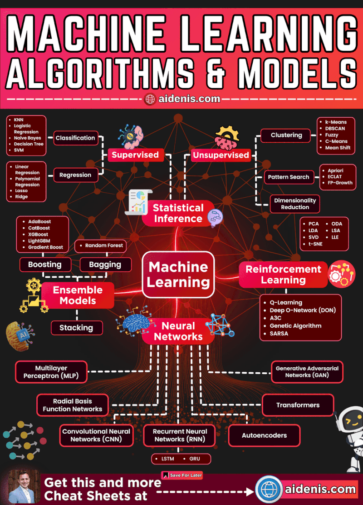

# Machine Learning

1️⃣ 🧮 𝗠𝗮𝘁𝗵𝗲𝗺𝗮𝘁𝗶𝗰𝘀 & 𝗦𝘁𝗮𝘁𝗶𝘀𝘁𝗶𝗰𝘀:
1.  Linear Algebra, Calculus, and Probability & Statistics -
  https://lnkd.in/eabKGp_p
1. OpenIntro Statistics - https://lnkd.in/eQvjgbmB

2️⃣ 🔯 𝗦𝗤𝗟 & 𝗗𝗮𝘁𝗮𝗯𝗮𝘀𝗲𝘀:
1. https://lnkd.in/ea2DmZ2d
 
  
3️⃣🤖 𝗖𝗼𝗿𝗲 𝗖𝗼𝗻𝗰𝗲𝗽𝘁𝘀 𝗼𝗳 𝗠𝗮𝗰𝗵𝗶𝗻𝗲 𝗟𝗲𝗮𝗿𝗻𝗶𝗻𝗴:
1. Google's ML Crash Course - https://lnkd.in/eT7NiGp6
1. Andrew Ng's Coursera ML Course - https://lnkd.in/e964AiC7
1. Fast.ai's Practical Deep Learning - https://course.fast.ai/

4️⃣ 💻 𝗣𝗿𝗼𝗴𝗿𝗮𝗺𝗺𝗶𝗻𝗴 𝗦𝗸𝗶𝗹𝗹𝘀 (𝗣𝘆𝘁𝗵𝗼𝗻 & 𝗟𝗶𝗯𝗿𝗮𝗿𝗶𝗲𝘀):
1. Corey Schafer's Python Tutorials - https://lnkd.in/euyfHHxa
1. Scikit-learn - https://lnkd.in/eqFhCwXt
1. TensorFlow - https://lnkd.in/e6RWbe9h
1. PyTorch - https://lnkd.in/efhPxZPM

5️⃣ 🎛️ 𝗠𝗼𝗱𝗲𝗹 𝗧𝗿𝗮𝗶𝗻𝗶𝗻𝗴 & 𝗧𝘂𝗻𝗶𝗻𝗴 𝗧𝗲𝗰𝗵𝗻𝗶𝗾𝘂𝗲𝘀:
1. Kaggle's Intermediate ML - https://lnkd.in/e89AmkzE
1. Hyperparameter Tuning - https://lnkd.in/ezEnqeG2

6️⃣ 🧠 𝗔𝗱𝘃𝗮𝗻𝗰𝗲𝗱 𝗗𝗲𝗲𝗽 𝗟𝗲𝗮𝗿𝗻𝗶𝗻𝗴 𝗠𝗼𝗱𝗲𝗹𝘀:
1. Stanford's CS231n (CNNs) - http://cs231n.github.io/
1. Deep Learning Book - https://lnkd.in/e_utEgZM

7️⃣ 🌐 𝗗𝗲𝗽𝗹𝗼𝘆𝗺𝗲𝗻𝘁, 𝗠𝗼𝗻𝗶𝘁𝗼𝗿𝗶𝗻𝗴, & 𝗠𝗮𝗶𝗻𝘁𝗲𝗻𝗮𝗻𝗰𝗲:
1. Docker - https://lnkd.in/esXHzx9k
1. Git - https://lnkd.in/esQ8FMxS
1. AWS ML - https://lnkd.in/eZcdQPee
1. Azure ML - https://lnkd.in/e5fvmvtk

8️⃣ 📝 𝗥𝗲𝘀𝘂𝗺𝗲 𝗣𝗿𝗲𝗽𝗮𝗿𝗮𝘁𝗶𝗼𝗻 ,𝗦𝗼𝗳𝘁 𝗦𝗸𝗶𝗹𝗹𝘀 & 𝗧𝗶𝗽𝘀 :
1. Resume - https://lnkd.in/eP7isRZF
1. Soft Skills & Tips -  https://lnkd.in/e_xE4wdr

9️⃣ 🎯 𝟮𝟭𝟳 𝗠𝗮𝗰𝗵𝗶𝗻𝗲 𝗟𝗲𝗮𝗿𝗻𝗶𝗻𝗴 𝗣𝗿𝗼𝗷𝗲𝗰𝘁𝘀:
1. https://lnkd.in/e5kyv3Tv

# AI & ML courses in 2023

𝗠𝗮𝗰𝗵𝗶𝗻𝗲 𝗟𝗲𝗮𝗿𝗻𝗶𝗻𝗴 𝗠𝗮𝗿𝘃𝗲𝗹𝘀:
1. Intro to Machine Learning: https://lnkd.in/ecqatZBA
1. Stanford: Machine Learning: https://lnkd.in/exNpHVgK
1. Making Friends with Machine Learning: https://lnkd.in/ejM83n2B
1. Applied Machine Learning: https://lnkd.in/eBPxJriR
1. Statistical Machine Learning: https://lnkd.in/eszaHhnn
1. Neural Networks: Zero to Hero: https://lnkd.in/eHyXfdMY

𝗗𝗲𝗲𝗽 𝗟𝗲𝗮𝗿𝗻𝗶𝗻𝗴 𝗗𝗶𝘀𝗰𝗼𝘃𝗲𝗿𝗶𝗲𝘀:
1. Introduction to Deep Learning (MIT): https://lnkd.in/eh7wTzbq
1. CMU Introduction to Deep Learning: https://lnkd.in/eCF92CDW
1. MIT: Deep Learning for Art, Aesthetics, and Creativity: https://lnkd.in/eURJKHUS
1. Stanford Deep Learning: https://lnkd.in/e6fWv3R8

𝗡𝗟𝗣 𝗡𝘂𝗴𝗴𝗲𝘁𝘀:
1. Stanford - Transformers: https://lnkd.in/eMHXPehx
1. NLP Course (Hugging Face): https://lnkd.in/ehhG4S_2
1. Natural Language Understanding: https://lnkd.in/emVV8CfA
1. CMU Advanced NLP 2022: https://lnkd.in/eXenh9pm

𝗖𝗼𝗺𝗽𝘂𝘁𝗲𝗿 𝗩𝗶𝘀𝗶𝗼𝗻 𝗩𝗲𝗻𝘁𝘂𝗿𝗲𝘀:
1. Deep Learning for Computer Vision: https://lnkd.in/eMk3kWSz

𝗥𝗲𝗶𝗻𝗳𝗼𝗿𝗰𝗲𝗺𝗲𝗻𝘁 𝗟𝗲𝗮𝗿𝗻𝗶𝗻𝗴 𝗥𝗲𝘃𝗲𝗹𝗮𝘁𝗶𝗼𝗻𝘀:
1. Foundations of Deep RL: https://lnkd.in/eAhySKAS
1. Deep Reinforcement Learning: https://lnkd.in/e6gyvp4s
1. Stanford: Reinforcement Learning: https://lnkd.in/eGR-5THW

# Python Project 
**Credit:** https://github.com/garimasingh128/awesome-python-projects

Read these articles to get a quick grab on Python:
- https://www.python.org/about/gettingstarted/
- https://www.learnpython.org
- https://www.programiz.com/python-programming

Resources to learn Git:
-  https://try.github.io/

References for Sentiment analyser ML project :
-  https://www.youtube.com/watch?v=dyN_WtjdfpA
-  https://www.geeksforgeeks.org/nlp-how-tokenizing-text-sentence-words-works/
-  https://www.geeksforgeeks.org/pyplot-in-matplotlib/

References for pin your note :
- https://www.youtube.com/watch?v=ilI3H2O5KYg
- https://www.tutorialspoint.com/python/time_sleep.htm
- https://www.geeksforgeeks.org/python-gui-tkinter/

References for Notification app :
-  https://www.youtube.com/watch?v=vPsM7qdnhzc
-  https://www.geeksforgeeks.org/desktop-notifier-python/
-  https://www.geeksforgeeks.org/python-desktop-notifier-using-plyer-module/

References for Contact Book Application :
- https://www.youtube.com/watch?v=0rzNAGe-gUs
- https://www.geeksforgeeks.org/python-tkinter-tutorial/
- https://www.geeksforgeeks.org/sql-using-python-sqlite-set-2/

References for Typing Speed Test :
- https://www.youtube.com/watch?v=0e6gmdYqXrc
- https://www.geeksforgeeks.org/python-string-split/
- https://www.geeksforgeeks.org/taking-input-in-python/

References for Secure your password:
- https://www.geeksforgeeks.org/taking-input-in-python/
- https://developers.google.com/edu/python/dict-files
- https://www.edureka.co/blog/print-in-python/

References for Tic Tac Toe:
- https://medium.com/byte-tales/the-classic-tic-tac-toe-game-in-python-3-1427c68b8874
- https://inventwithpython.com/chapter10.html
- https://www.geeksforgeeks.org/python-implementation-automatic-tic-tac-toe-game-using-random-number/

References for Password manager:
- https://www.geeksforgeeks.org/python-gui-tkinter/
- https://www.geeksforgeeks.org/generating-strong-password-using-python/
- https://www.geeksforgeeks.org/file-handling-python/

References for Weather application:
- https://www.youtube.com/watch?v=vJCjDevYDt8
- http://tomasz-kluczkowski.com/project/the-weather-app/
- https://www.geeksforgeeks.org/python-real-time-weather-detection-using-tkinter/
- https://github.com/Tomasz-Kluczkowski/Weather-App

References for Air quality detector:
- https://www.youtube.com/watch?v=vJCjDevYDt8

References for Iris Flower Detector:
- https://en.wikipedia.org/wiki/Iris_flower_data_set
- https://en.wikipedia.org/wiki/Support_vector_machine
- https://www.youtube.com/watch?v=Y17Y_8RK6pc

References for Flight Fare Prediction:
- https://www.kaggle.com/nikhilmittal/flight-fare-prediction-mh
- https://scikit-learn.org/stable/modules/generated/sklearn.linear_model.
 LinearRegression.html
-  https://medium.com/code-to-express/flight-price-prediction-7c83616a13bb

References for Rock Paper Scissor:
- https://www.geeksforgeeks.org/python-program-implement-rock-paper-scissor-game
- https://www.afiniti.com/corporate/rock-paper-scissors
- https://www.tes.com/teaching-resource/building-a-rock-paper-scissors-game-using-scratch-11268599
- https://www.youtube.com/watch?v=KnVwmBh1bo0

References for Rolling Dice:
- https://www.geeksforgeeks.org/python-if-else/#if-elif
- https://www.geeksforgeeks.org/python-while-loops/?ref=lbp
- https://www.tutorialsteacher.com/python/random-module

References for Quiz Application:
- https://www.youtube.com/watch?v=VR-yNEpGk3g
- https://www.geeksforgeeks.org/python-multiple-choice-questions/
- https://www.youtube.com/watch?v=cwJBEZjQJtc

References for License Plate Detection :
- http://youtube.com/watch?v=GXyLSx8l9gM
- https://docs.opencv.org/master/d9/df8/tutorial_root.html

References for Alarm Clock :
- https://www.tutorialspoint.com/python/python_gui_programming.htm
- https://docs.python.org/3/library/datetime.html

References for Simple Calculator
- https://www.geeksforgeeks.org/make-simple-calculator-using-python/https://www.geeksforgeeks.org/make-simple-calculator-using-python/` https://www.youtube.com/watch?v=miC7ni64hbw
- https://www.youtube.com/watch?v=B1U0gUhUeQs

References for File Renaming Tool
- https://www.geeksforgeeks.org/rename-multiple-files-using-python/
- https://docs.python.org/3/

References for IRIS FLOWER CLASSIFICATION USING ML:
- https://medium.com/gft-engineering/start-to-learn-machine-learning-with-the-iris-flower-classification-challenge-4859a920e5e3
- https://www.neuraldesigner.com/learning/examples/iris-flowers-classification
- https://www.skyfilabs.com/project-ideas/iris-flower-classification-using-machine-learning
- https://analyticsindiamag.com/start-building-first-machine-learning-project-famous-dataset/
- https://www.youtube.com/watch?v=FLuqwQgSBDw&ab_channel=AppliedAICourse
- https://www.youtube.com/watch?v=CLvboTdwpjc&ab_channel=RealKnow
- https://youtu.be/Y17Y_8RK6pc?list=PL5tcWHG-UPH1OeZ2vU5xQd7RVpkWvwJny
- https://youtu.be/ACdBKML9l4s

Reference for Using Google API
- https://github.com/googleapis/google-api-python-client
- https://www.youtube.com/watch?v=IVjZMIWhz3Y

References for Admission Prediction using ML
- https://www.udemy.com/share/103wKGAEETdltURH8B/

References for IPL score predictor
- https://youtu.be/4CtyDxfhoN8

Refrences for Twitter Sentiment Analysis using ML
- https://towardsdatascience.com/social-media-sentiment-analysis-49b395771197
- https://towardsdatascience.com/social-media-sentiment-analysis-part-ii-bcacca5aaa39

Reference for Credit Card Fraud Detection 
- https://www.geeksforgeeks.org/ml-credit-card-fraud-detection/

References for alarm clock
- https://youtube.com/playlist?list=PLu0W_9lII9ajLcqRcj4PoEihkukF_OTzA
- https://itsourcecode.com/free-projects/python-projects/alarm-clock-using-python-with-source-code/

# 𝗙𝗥𝗘𝗘 𝗖𝗼𝘂𝗿𝘀𝗲𝘀 𝘆𝗼𝘂 𝘄𝗶𝗹𝗹 𝗿𝗲𝗴𝗿𝗲𝘁 𝗻𝗼𝘁 𝘁𝗮𝗸𝗶𝗻𝗴 𝗶𝗻 𝟮𝟬𝟮𝟰.
1. Introduction Generative to Al : https://lnkd.in/detitq8h
2. Generative AI with Large Language Models : https://lnkd.in/dKkYeknp
3. Generative Adversarial Networks (GANs) Specialization : https://lnkd.in/dyXgBExM
4. Introduction to Artificial Intelligence (AI) : https://lnkd.in/d2Awst5W
5. Generative AI Primer : https://lnkd.in/d5Mxw9m3
6. Natural Language Processing Specialization : https://lnkd.in/dwHpf5St
7. Deep Learning Specialization : https://lnkd.in/d6cWvJ_9
8. Generative AI for Data Scientists Specialization : https://lnkd.in/d-MCw8k5
9. IBM Data Science Professional Certificate : https://lnkd.in/d2cBszG5
10. Introduction to Data Science : https://lnkd.in/dKGf-KtB
11. Learn SQL Basics for Data Science : https://lnkd.in/dCpZ-NRX
12. Python for Everybody : https://lnkd.in/dicyAtC4
13. Machine Learning Specialization : https://lnkd.in/dW7wUUcx
14. Data Science Fundamentals with Python & SQL Specialization : https://lnkd.in/dkfRpT9e
15. Excel Skills for Data Analytics and Visualization : https://lnkd.in/dgvEw2e5
16. Crash Course on Python : https://lnkd.in/dsCQJQpk
17. IBM Data Analytics with Excel and R : https://lnkd.in/duHEEBRR
18. Excel to MySQL: Analytic Techniques for Business : https://lnkd.in/dfpewZ-b
19. Advanced Google Analytics : https://lnkd.in/d-n-za6p
20. Google Project Management : https://lnkd.in/dtTiGX8N
21. Agile Project Management : https://lnkd.in/d_Zk7zdi
22. Project Execution: Running the Project : https://lnkd.in/d69b7erj
23. Foundations of Project Management : https://lnkd.in/dy77uH67
24. Project Initiation: Starting a Successful Project : https://lnkd.in/dsZFaNmi
25. Project Planning: Putting It All Together : https://lnkd.in/d5zrVak6
26. Google Data Analytics : https://lnkd.in/dVAzUSJd
27. Get Started with Python : https://lnkd.in/diX9mRw6
28. Learn Python Basics for Data Analysis : https://lnkd.in/dimjFgx5 - https://lnkd.in/dz2AZZB8
29. Google Advanced Data Analytics Capstone : https://lnkd.in/dcVTcbih
30. Data Analysis with R Programming : https://lnkd.in/dwpP4xT3

1) IBM Data Science Professional Certificate :-
🔗  https://lnkd.in/gZYKPv2q

2) Coding Interview Preparation :-
🔗 https://lnkd.in/gktucK6V

3) Data Structures and Algorithms Specialization:-
🔗 https://lnkd.in/gAiquq9e

4) Learn HTML and CSS :-
🔗 https://lnkd.in/gb5YD59d

5) Introduction to Web Development with HTML, CSS, JavaScript:-
🔗 https://lnkd.in/gys2aGBj

6) HTML, CSS, and Javascript for Web Developers :-
🔗 https://lnkd.in/g3DQ-8K2

7) Python for Cybersecurity Specialization:-
🔗 https://lnkd.in/gtYfzgNx

8) Google Cybersecurity Professional Certificate:-
🔗 https://lnkd.in/gDgYuHVS

9) Microsoft Cybersecurity Analyst Professional Certificate:-
🔗 https://lnkd.in/gBqGwdmR

10) IBM Data Science Professional Certificate :-
🔗  https://lnkd.in/gZYKPv2q

11) Data Science Specialization:-
🔗https://lnkd.in/gFqb59Ys

12) Python for Data Science, AI & Development:-
🔗https://lnkd.in/gsgBys3g

13) Google Data Analytics Professional Certificate:-
🔗https://lnkd.in/gEkR6DRb

14) Applied Data Science with Python Specialization:-
🔗https://lnkd.in/gdhdXcxh

15) Foundations of Data Science:-
🔗 https://lnkd.in/gfrMPcF7

16) IBM Data Analyst Professional Certificate:-
🔗https://lnkd.in/gjrzuQcH

17) Python Project for Data Science :-
🔗 https://lnkd.in/gN4e-J73

18) Data Science Fundamentals with Python and SQL Specialization:-
🔗 https://lnkd.in/gZQu7CvW

19) A Crash Course in Data Science:-
🔗 https://lnkd.in/guHnAEUU

20) Microsoft Power BI Data Analyst Professional Certificate:-
🔗 https://lnkd.in/gspbeMba

21) Machine Learning Specialization :-
🔗https://lnkd.in/gAYkNJ4p

22) Generative AI for Data Scientists Specialization :-
🔗 https://lnkd.in/gu7mVjzS

23) Introduction to Artificial Intelligence (AI) :-
🔗  https://lnkd.in/gg4mNsf3