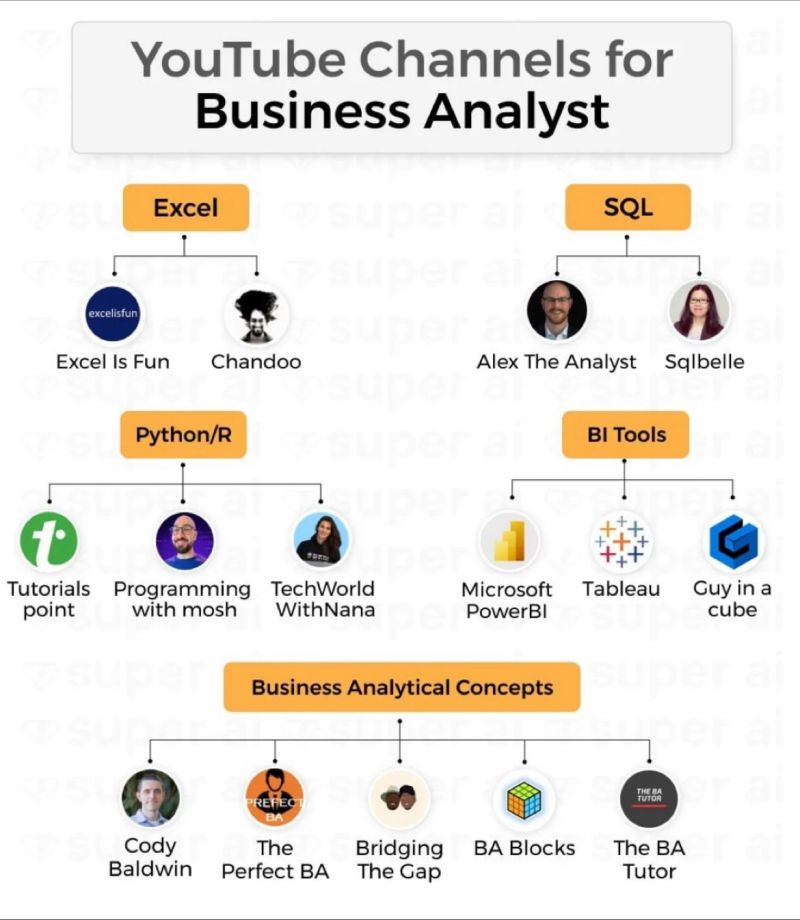

# Microsoft Power BI Courses
|Sno|Title|Course By/Course Link|Link|
|--|--|--|--|
|1|Power BI Tutorial From Beginner to Pro ⚡ Desktop to Dashboard in 60 Minutes ⏰ |Avi Singh|https://lnkd.in/gJtFnzie|
|2|Power BI Full Course|Simplilearn|https://lnkd.in/gtCHBs4c|
|3|Learn Power BI in 4 Hours | Edureka|https://lnkd.in/gCQ3xTyM|
|4|Complete Power BI Tutorial 8+ hours | Learnit Training| https://lnkd.in/gDne7-_h|
|5|Hands-On Power BI Tutorial 📊Beginner to Pro 2023 Edition [Full Course]⚡| Devin Knight|https://lnkd.in/gjQ8-nyr|
|6|Complete Power BI DAX End to End 3 Hours |Analytics with Nags|https://lnkd.in/gXn7jqpB|
|7|Complete Power BI DAX End to End 8 hours |Milestone Creator| https://lnkd.in/gXTC7n6F|
|1|Guy in a Cube|https://lnkd.in/dhUp4ST2|https://lnkd.in/dXarv_Sf|
|2|RADACAD|https://lnkd.in/dmuySyTU|https://radacad.com/blog|
|3️|PowerBI.tips|https://lnkd.in/dwhz8m6P|https://powerbi.tips/|
|4|Excelerator BI|https://lnkd.in/dPPkz6hP|https://lnkd.in/dUcad39u|
|5|SQLBI|https://lnkd.in/dS4tyfzf|https://www.sqlbi.com/|
|6|Curbal|https://lnkd.in/duvWvFyD|https://curbal.com/|
|7|Enterprise DNA|https://lnkd.in/dVwvJT-k|https://lnkd.in/d_w8Crff
|8|Chandeep Chhabra|https://lnkd.in/dzwitsKf|https://lnkd.in/ddsCXs8B
|9|Excel Resource|https://lnkd.in/dzzZr8dF
|10|Python For Power BI|https://lnkd.in/d9FUWPGc
|11|R For Power BI|https://lnkd.in/dXWGxzRm
|12|MySQL Resources|https://lnkd.in/dbbqJjKc
|13|Mongo DB|https://lnkd.in/dw9kx8W4
|14|Statistics & Probability|https://lnkd.in/dnYRYSGq

# 𝗙𝘂𝗹𝗹 𝗣𝗼𝘄𝗲𝗿 𝗕𝗜 𝗖𝗼𝘂𝗿𝘀𝗲𝘀 𝗼𝗻 𝗬𝗼𝘂𝗧𝘂𝗯𝗲
1. Power BI Full Course 2023 in 8 Hours: https://lnkd.in/dYb9CvB3
1. Hands-On Power BI Tutorial: Beginner to Pro: https://lnkd.in/gtB9YSM6
1. Power BI Full Course - Learn Power BI in 4 Hours: https://lnkd.in/gi2CKw4t
1. Power BI Full Course 2022: https://lnkd.in/gBEswDxR
1. Power BI Tutorial For Beginners: https://lnkd.in/g887j9C5

# 𝗣𝗼𝘄𝗲𝗿 𝗕𝗜 𝗗𝗔𝗫
1. Complete Power BI DAX End to End: https://lnkd.in/dQX7rGbh

# 𝗗𝗼𝗰𝘂𝗺𝗲𝗻𝘁𝗮𝘁𝗶𝗼𝗻
1. Microsoft Power BI documentation: https://lnkd.in/dbAT7QQ9
1. Learn from Power BI community: https://lnkd.in/d3-FGaUq

# Microsoft Offering FREE Power BI Courses for 2023 with Certificates 🔥🔥

1. Microsoft Certified: Power BI Data Analyst Associate – Certifications : https://lnkd.in/diqHhamu
2. Getting Started with Power BI Desktop : https://lnkd.in/dP-MQZpH
3. Build Dashboards in Power BI : https://lnkd.in/dkx9pkHN
4. Power BI for Beginners Introduction to Business Intelligence : https://lnkd.in/dA8Hjjhj
5. Use Power Bi for Financial Data Analysis : https://lnkd.in/d6eeHpF3
6. Data-Driven Decisions with Power BI : https://lnkd.in/dNG8ny3s
7. HR Analytics- Build an HR dashboard using Power BI : https://lnkd.in/dj5kSMed
8. Create a Sales Dashboard using Power BI : https://lnkd.in/dxFNAn5Z
9. Build an Income Statement Dashboard in Power BI : https://lnkd.in/dBKwsEpx
10. Power BI for Beginners: Designing a Data Model : https://lnkd.in/d8xwdpXZ
11. Power BI for Beginners: Preparing Data For Analysis : https://lnkd.in/dmERvXj4
12. Power Bi Report Development Crash Course : https://lnkd.in/dazuDdXM

# Others 
1. Excel: https://lnkd.in/dxuqGrzQ
2. Tableau: https://lnkd.in/dzZnRFT2
3. PowerBi: https://lnkd.in/d4RnYuJG
4. SQL: https://www.w3schools.com
5. Python: https://lnkd.in/dcJi-aMB

# Youtube Channels For BA 

|Sno|Topic| | | | | |
|--|--|--|--|--|--|--|
|1| Excel | Excel Is Fun : https://www.youtube.com/@excelisfun | Chandoo : https://www.youtube.com/@chandoo_ | 
|2| SQL   | Alex The Analyst : https://www.youtube.com/@AlexTheAnalyst | Sqlbelle : https://www.youtube.com/@sqlbelle | 
|3| Python /R | Tutorials Point : https://www.youtube.com/@TutorialsPoint_ | Programming With Mosh : https://www.youtube.com/@programmingwithmosh| TechWorld With Nana :https://www.youtube.com/@TechWorldwithNana | 
|4| BI Tools| MicrosoftPowerBI : https://www.youtube.com/@MicrosoftPowerBI | Tableau : https://www.youtube.com/@Tableau-eo8gj | Guy in a cube : https://www.youtube.com/@GuyInACube| 
|5| Business Analytical Concepts | Cody Baldwin : https://www.youtube.com/@codymbaldwin | The Perfect BA : https://www.youtube.com/@ThePrefectBA| Bridging The Gap : https://www.youtube.com/@BridgingTheGapYT| BA Blocks : https://www.youtube.com/@BABLOCKS| The BA Tutor : https://www.youtube.com/@TheBATutor | 
