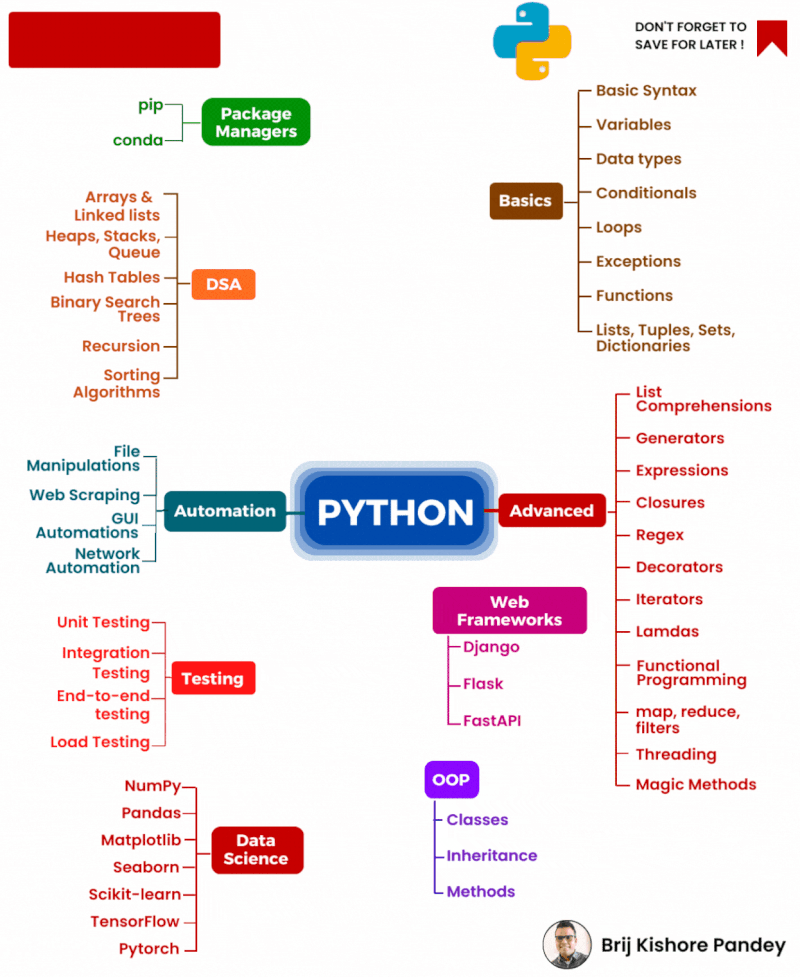

# Python Zero To Hero

1️⃣ 𝗠𝗼𝗻𝘁𝗵 𝟭: 𝗚𝗲𝘁 𝘆𝗼𝘂𝗿 𝗯𝗮𝘀𝗶𝗰𝘀 𝗿𝗶𝗴𝗵𝘁

1. Learn Python: https://lnkd.in/eb4ke-9P
2. Python Projects: https://lnkd.in/eNWBfNzk
3. DSA with Python: http://bit.ly/3G3Dh0V

2️⃣ 𝗠𝗼𝗻𝘁𝗵 𝟮: 𝗗𝗶𝘃𝗲 𝗶𝗻𝘁𝗼 𝗙𝗹𝗮𝘀𝗸 𝗮𝗻𝗱 𝗔𝗣𝗜

1. Learn Flask: https://lnkd.in/eqAg3jZP
1. Flask Projects: https://lnkd.in/eqnf7h-W
1. Learn REST API with Flask: https://lnkd.in/e-TTahQf

3️⃣ 𝗠𝗼𝗻𝘁𝗵 𝟯: 𝗠𝗮𝘀𝘁𝗲𝗿 𝗮𝗱𝘃𝗮𝗻𝗰𝗲𝗱 𝗰𝗼𝗻𝗰𝗲𝗽𝘁𝘀 𝗮𝗻𝗱 𝗱𝗮𝘁𝗮𝗯𝗮𝘀𝗲𝘀

1. Learn Multithreading, Multiprocessing, Asyncio: https://lnkd.in/e_99Jiwp
2. Gunicorn & Nginx with Flask: https://lnkd.in/eWxgTNdB
3. TDD with Python & Flask: https://lnkd.in/eMjweHuZ
4. Basic RDBMS: https://lnkd.in/ebkPd8-q
5. Learn SQL: https://sqlbolt.com/ & W3Schools.com
6. PostgreSQL with Python: https://lnkd.in/esKUqNdt
7. Flask App with PostgreSQL: https://lnkd.in/eTzpcwNc
   
4️⃣ 𝗠𝗼𝗻𝘁𝗵 𝟰: 𝗣𝗼𝗹𝗶𝘀𝗵 𝘆𝗼𝘂𝗿 𝘀𝗸𝗶𝗹𝗹𝘀 𝗮𝗻𝗱 𝗽𝗿𝗲𝗽𝗮𝗿𝗲 𝗳𝗼𝗿 𝘁𝗵𝗲 𝗷𝗼𝗯 𝗺𝗮𝗿𝗸𝗲𝘁

1. Basics of Bash: https://lnkd.in/eZnG8cP6
2. Basics of Docker: https://lnkd.in/eFEK_aXW
3. Deploy Flask App with Docker: https://lnkd.in/eTjnFW8Y
4. GIT & GitHub: https://lnkd.in/ejshTxFw
5. Python Portfolio on Github: https://lnkd.in/eB2AanXj
6. Python Resume Ideas: https://lnkd.in/e_Fb7uNi

# Roadmap for Python

1. Basic Python: https://lnkd.in/eb4ke-9P
1. Advanced Python: https://lnkd.in/eysAqzGf
1. Python for Data Science, Analytics & Engineering: https://lnkd.in/e-YB25Tg
1. Learn Flask & APIs: https://lnkd.in/eAcxdtEa
1. Automation with Python: https://lnkd.in/e2kFD5DF
1. Flask App using TDD approach: https://lnkd.in/eMjweHuZ
1. Data Structures & Algorithms in Python: https://lnkd.in/es8ujeEA
1. Learn Python: https://lnkd.in/eb4ke-9P
1. Python Projects: https://lnkd.in/eNWBfNzk
1. DSA with Python: http://bit.ly/3G3Dh0V
1. Learn Flask: https://lnkd.in/eqAg3jZP
1. Flask Projects: https://lnkd.in/eqnf7h-W
1. Learn REST API with Flask: https://lnkd.in/e-TTahQf
1. Learn Multithreading & Asyncio: https://lnkd.in/e_99Jiwp
1. Gunicorn & Nginx with Flask: https://lnkd.in/eWxgTNdB
1. TDD with Python & Flask: https://lnkd.in/eMjweHuZ
1. Basic RDBMS: https://lnkd.in/ebkPd8-q
1. Learn SQL: https://sqlbolt.com/ & W3Schools.com
1. PostgreSQL with Python: https://lnkd.in/esKUqNdt
1. Flask App with PostgreSQL: https://lnkd.in/eTzpcwNc
1. Basics of Bash: https://lnkd.in/eZnG8cP6
1. Basics of Docker: https://lnkd.in/eFEK_aXW
1. Deploy Flask App with Docker: https://lnkd.in/eTjnFW8Y
1. GIT & GitHub: https://lnkd.in/ejshTxFw
1. Python Portfolio on Github: https://lnkd.in/eB2AanXj
1. Python Resume Ideas: https://lnkd.in/e_Fb7uNi

## https://github.com/prembadri/awesome-python-projects 

## Web Development with Flask:
    * Learn Flask: https://lnkd.in/eqAg3jZP
    * Flask Projects: https://lnkd.in/eqnf7h-W
    * Learn REST API with Flask: https://lnkd.in/e-TTahQf
    * Multithreading & Asyncio: https://lnkd.in/e_99Jiwp
    * Gunicorn & Nginx with Flask: https://lnkd.in/eWxgTNdB
    * TDD with Python & Flask: https://lnkd.in/eMjweHuZ

## Databases:
    * Basic RDBMS: https://lnkd.in/ebkPd8-q
    * Learn SQL: sqlbolt.com & W3Schools.com
    * PostgreSQL with Python: https://lnkd.in/esKUqNdt
    * Flask App with PostgreSQL: https://lnkd.in/eTzpcwNc

## Deployment:
    * Basics of Bash: https://lnkd.in/eZnG8cP6
    * Basics of Docker: https://lnkd.in/eFEK_aXW
    * Deploy Flask App with Docker: https://lnkd.in/eTjnFW8Y

## Version Control:
    * GIT & GitHub: https://lnkd.in/ejshTxFw
    * Python Portfolio on Github: https://lnkd.in/eB2AanXj

1. 𝗖𝗦𝟱𝟬𝗣 𝗳𝗿𝗼𝗺 𝗛𝗮𝗿𝘃𝗮𝗿𝗱 𝗨𝗻𝗶𝘃𝗲𝗿𝘀𝗶𝘁𝘆 - https://lnkd.in/db9J9rTZ
1. 𝗣𝘆𝘁𝗵𝗼𝗻 𝗳𝗼𝗿 𝗗𝗮𝘁𝗮 𝗦𝗰𝗶𝗲𝗻𝗰𝗲 𝗯𝘆 𝗜𝗕𝗠 - https://lnkd.in/dYDPhs8f
1. 𝗜𝗻𝘁𝗿𝗼𝗱𝘂𝗰𝘁𝗶𝗼𝗻 𝘁𝗼 𝗣𝘆𝘁𝗵𝗼𝗻 𝗯𝘆 𝗨𝗱𝗮𝗰𝗶𝘁𝘆 - https://lnkd.in/d276-W_2
1. 𝗟𝗲𝗮𝗿𝗻 𝗣𝘆𝘁𝗵𝗼𝗻 𝗯𝗮𝘀𝗶𝗰𝘀 - https://learnpython.org
1. 𝗟𝗲𝗮𝗿𝗻 𝗣𝘆𝘁𝗵𝗼𝗻 - 𝗙𝘂𝗹𝗹 𝗖𝗼𝘂𝗿𝘀𝗲 - https://lnkd.in/ddzsCv3g
6. Machine Learning with Python - https://lnkd.in/d46GH7Ms
7. Python for Beginners (2023) - https://lnkd.in/dNmdWBbh
8. Learn Python for Total Beginners - https://lnkd.in/de-9jxY4
9. Python for Data Science, AI & Development - https://lnkd.in/ddptfRha
10. Python for Everybody Specialization - https://lnkd.in/d_6jwkrR
11. Crash Course on Python - https://lnkd.in/d5riX4ie
12. Google IT Automation with Python Professional Certificate -https://lnkd.in/dHJJc2gB
13. Python 3 Programming Specialization - https://lnkd.in/dbrtiZq9
14. Get Started with Python by Google - https://lnkd.in/dcFc6i9T
15. Programming in Python by Meta - https://lnkd.in/dHyETcG2
16. Data Analysis with Python by IBM - https://lnkd.in/dCkR_UFW