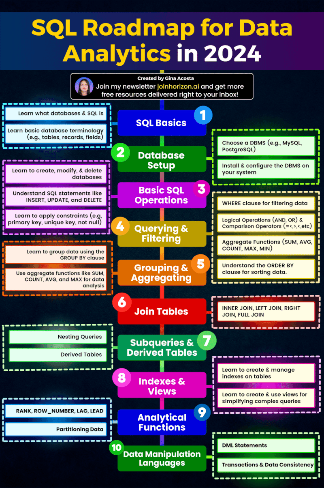

# SQL Courses for All  

1. SQL for Data Science : https://lnkd.in/d-7d5ATD
1. Databases and SQL for Data Science with Python : https://lnkd.in/d3qZ8W-b
1. Scripting with Python and SQL for Data Engineering : https://lnkd.in/dC9miqwc
1. Introduction to Structured Query Language (SQL) : https://lnkd.in/dNFvB3An
1. Introduction to SQL for BigQuery and Cloud SQL : https://lnkd.in/dZmN9vgg
1. Foundations for Big Data Analysis with SQL : https://lnkd.in/dVsP68QX
1. Analyzing Big Data with SQL : https://lnkd.in/ddkVWpDj
1. Managing Big Data with MySQL :   https://lnkd.in/dG2Dsx7X
1. SQL for Data Science with R : https://lnkd.in/dwwXEuy8
1. Microsoft Azure SQL : https://lnkd.in/dzBXY9DR
1. Oracle SQL Basics : https://lnkd.in/dMSriaMu
1. Troubleshooting Common SQL Errors with BigQuery : https://lnkd.in/daZwaWMk

## 𝗦𝘁𝗲𝗽 𝟭: 𝗨𝗻𝗱𝗲𝗿𝘀𝘁𝗮𝗻𝗱𝗶𝗻𝗴 𝗗𝗮𝘁𝗮𝗯𝗮𝘀𝗲𝘀 𝗮𝗻𝗱 𝗦𝗤𝗟 🌐

1. Basics with Guru99: https://lnkd.in/eKwym7-E
1. Introduction to SQL with Khan Academy: https://lnkd.in/eTfnMCwG

## 𝗦𝘁𝗲𝗽 𝟮: 𝗕𝗮𝘀𝗶𝗰𝘀 𝗼𝗳 𝗦𝗤𝗟 🏁

1. SQL syntax, keywords, basic commands with Codecademy: https://lnkd.in/efMKFkfX
1. Data types, functions, operators with W3Schools.com : https://lnkd.in/eYqMX692

## 𝗦𝘁𝗲𝗽 𝟯: 𝗜𝗻𝘁𝗲𝗿𝗺𝗲𝗱𝗶𝗮𝘁𝗲 𝗦𝗤𝗟 🎣

1. Deep dive into subqueries with MySQLTutorial: https://lnkd.in/ee7HwTjd
1. SQL aggregations, group by clause with Mode Analytics: https://lnkd.in/esCuSAzy
1. Joins, set operations with Khan Academy: https://lnkd.in/eTgmnp_y

## 𝗦𝘁𝗲𝗽 𝟰: 𝗔𝗱𝘃𝗮𝗻𝗰𝗲𝗱 𝗦𝗤𝗟 🚀

Unlock the power of CTEs with PostgreSQL Tutorial:
1. https://lnkd.in/enT6wK5N

Decode window functions with Mode Analytics:
1. https://lnkd.in/e6cs9dqr

Views, indexes, transactions with SQL Server Tutorial:
1. https://lnkd.in/e5C_p3-i
1. https://lnkd.in/eWgTe3Jb
1. https://lnkd.in/ep7rJQWh

Stored procedures, triggers with MySQL Tutorial:

1. https://lnkd.in/emMG279B
1. https://lnkd.in/e__muFim

## 𝗦𝘁𝗲𝗽 𝟱: 𝗗𝗮𝘁𝗮𝗯𝗮𝘀𝗲 𝗗𝗲𝘀𝗶𝗴𝗻 𝗮𝗻𝗱 𝗧𝗵𝗲𝗼𝗿𝘆 🎨
1. Normalization, denormalization, ER diagrams, data modeling with Coursera (Audit for free):
https://lnkd.in/ernSvrqd

## 𝗦𝘁𝗲𝗽 𝟲: 𝗦𝗤𝗟 𝗳𝗼𝗿 𝗗𝗮𝘁𝗮 𝗔𝗻𝗮𝗹𝘆𝘀𝗶𝘀 📊
1. Real-life data and SQL for data analysis with Mode Analytics: https://lnkd.in/eJWvGqfc

## 𝗦𝘁𝗲𝗽 𝟳: 𝗣𝗿𝗮𝗰𝘁𝗶𝗰𝗲, 𝗣𝗿𝗮𝗰𝘁𝗶𝗰𝗲, 𝗣𝗿𝗮𝗰𝘁𝗶𝗰𝗲! 🎯
Apply what you've learned by solving problems with

1. 𝗪𝟯𝗦𝗰𝗵𝗼𝗼𝗹𝘀.𝗰𝗼𝗺 : https://lnkd.in/eEmwWiTQ
1. 𝗦𝗤𝗟𝗭𝗼𝗼: https://sqlzoo.net/,
1. 𝗟𝗲𝗲𝘁𝗖𝗼𝗱𝗲: https://lnkd.in/eSQRAuKY

## Boost Your Database Skills 

1. Introduction to Structured Query Language (SQL) -
🔗https://lnkd.in/d-hrhZJx
2. Introduction to SQL for BigQuery and Cloud SQL
🔗https://lnkd.in/diavsS_r
3. Foundations for Big Data Analysis with SQL
🔗https://lnkd.in/drd3UwZ2
4. Analyzing Big Data with SQL
🔗https://lnkd.in/dfGwHKf9
5. Managing Big Data with MySQL
🔗https://lnkd.in/dAZfi_S8
6. SQL for Data Science
🔗https://lnkd.in/dczhErhD
7. Databases and SQL for Data Science with Python
🔗https://lnkd.in/dmArMcgR
8. Scripting with Python and SQL for Data Engineering
🔗https://lnkd.in/du3_Y7pd
9. SQL for Data Science with R
🔗https://lnkd.in/dAXkKS7s
10. Microsoft Azure SQL
🔗https://lnkd.in/dGVx3xV4
11. Oracle SQL Basics
🔗https://lnkd.in/deHZdjvB
12. Troubleshooting Common SQL Errors with BigQuery
🔗https://lnkd.in/dEb3NwJr

## F𝗿𝗲𝗲 𝗿𝗲𝘀𝗼𝘂𝗿𝗰𝗲𝘀

1. freecodecamp.org: https://lnkd.in/duCfNtTW
1. Programming with Mosh: https://lnkd.in/dFT8UQ4x
1. techTFQ: https://lnkd.in/d_aSwXpJ
1. Alex the Analyst: https://lnkd.in/dCXcY82Z

## 𝗔𝗱𝗱𝗶𝘁𝗶𝗼𝗻𝗮𝗹 𝗳𝗿𝗲𝗲 𝗿𝗲𝘀𝗼𝘂𝗿𝗰𝗲𝘀

1. SQLBolt: http://sqlbolt.com
1. SQLZoo: https://lnkd.in/dCa9Vwgv
1. SQLTest: http://sqltest.net
1. W3Schools.com: http://w3schools.com/sql/
1. Codecademy: https://lnkd.in/d2J3956R

# SQL Road Map

## 𝟭. 𝗬𝗼𝘂 𝗰𝗮𝗻 𝗽𝗿𝗮𝗰𝘁𝗶𝗰𝗲 𝗦𝗤𝗟 𝗼𝗻 𝘁𝗵𝗲𝘀𝗲 𝘄𝗲𝗯𝘀𝗶𝘁𝗲𝘀, 𝗻𝗼 𝗻𝗲𝗲𝗱 𝘁𝗼 𝗶𝗻𝘀𝘁𝗮𝗹𝗹 𝗮𝗻𝘆𝘁𝗵𝗶𝗻𝗴.
- https://sqlbolt.com/
- https://lnkd.in/eH9Qqa3h
- https://lnkd.in/ed4-E3vH

## 𝟮. 𝗜𝗻𝘁𝗿𝗼 𝘁𝗼 𝗥𝗲𝗹𝗮𝘁𝗶𝗼𝗻𝗮𝗹 𝗗𝗮𝘁𝗮𝗯𝗮𝘀𝗲𝘀
- https://lnkd.in/e6GCb-_X

## 𝟯. 𝗔𝗴𝗴𝗿𝗲𝗴𝗮𝘁𝗲 𝗙𝘂𝗻𝗰𝘁𝗶𝗼𝗻𝘀
- https://lnkd.in/eCfHtrjZ

## 𝟰. 𝗦𝘂𝗯𝗾𝘂𝗲𝗿𝗶𝗲𝘀 𝘄𝗶𝘁𝗵 𝗘𝘅𝗮𝗺𝗽𝗹𝗲𝘀 
- https://lnkd.in/eKFgfWNf

## 𝟱. 𝗦𝗤𝗟 𝗳𝗼𝗿 𝗗𝗮𝘁𝗮 𝗔𝗻𝗮𝗹𝘆𝘀𝗶𝘀
- https://lnkd.in/eSifcBY4

## 𝟲. 𝟭𝟱 𝗗𝗮𝘆𝘀 𝗼𝗳 𝗟𝗲𝗮𝗿𝗻𝗶𝗻𝗴 𝗦𝗤𝗟
- https://lnkd.in/eXm-CvmA

## 𝟳. 𝗔𝗱𝘃𝗮𝗻𝗰𝗲𝗱 𝗦𝗤𝗟
- https://lnkd.in/eb8qyFmB

## 𝟴. 𝗦𝗤𝗟 𝗖𝗮𝘀𝗲 𝗦𝘁𝘂𝗱𝘆 𝗮𝗻𝗱 𝟮𝟬+ 𝗦𝗤𝗟 𝗣𝗿𝗼𝗯𝗹𝗲𝗺𝘀
- https://lnkd.in/eSrPyXKC

## 𝟵. 𝗣𝗿𝗲𝗽𝗮𝗿𝗲 𝗳𝗼𝗿 𝗜𝗻𝘁𝗲𝗿𝘃𝗶𝗲𝘄𝘀
- https://datalemur.com/

## 𝟭𝟬. 𝗦𝗤𝗟 𝗠𝗼𝗰𝗸 𝗜𝗻𝘁𝗲𝗿𝘃𝗶𝗲𝘄 (𝗗𝗮𝘁𝗮 𝗔𝗻𝗮𝗹𝘆𝘀𝘁)
- https://lnkd.in/ey4hhkDk

# 𝐒𝐐𝐋 𝐏𝐫𝐨𝐣𝐞𝐜𝐭𝐬 𝐰𝐢𝐭𝐡 𝐃𝐚𝐭𝐚𝐬𝐞𝐭𝐬

🔴 E-commerce Sales Analysis: (Dataset) Online retail dataset from the UCI Machine Learning Repository : https://lnkd.in/guQYxkrB
🔴 Social Media Analytics: Twitter API or Twitter datasets are available on platforms like Kaggle : https://lnkd.in/gPyZ-Sjw
🔴 Healthcare Data Management: MIMIC-III (Medical Information Mart for Intensive Care III) dataset : https://lnkd.in/gN25duPP
🔴 Retail Inventory Management: Sample retail sales dataset available on platforms like Kaggle : https://lnkd.in/gJipDPyT
🔴 Financial Portfolio Analysis: Yahoo Finance API or finance datasets available on platforms like Kaggle : https://lnkd.in/gY_v2BJx
🔴 Real Estate Market Analysis: Zillow dataset : https://lnkd.in/gGUEQPb2
🔴 Real estate datasets available on platforms like Kaggle : https://lnkd.in/gs2aYYnv 